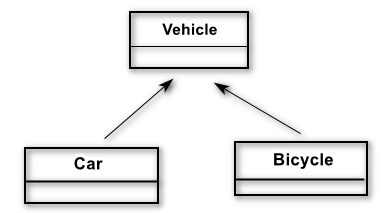
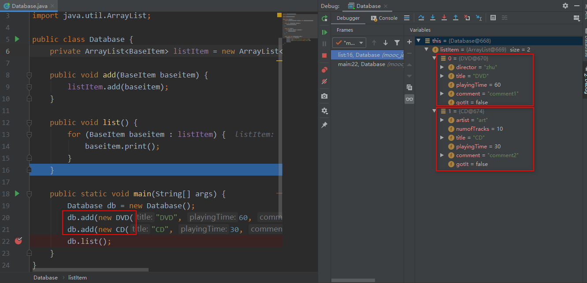
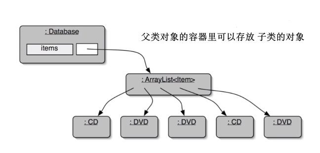
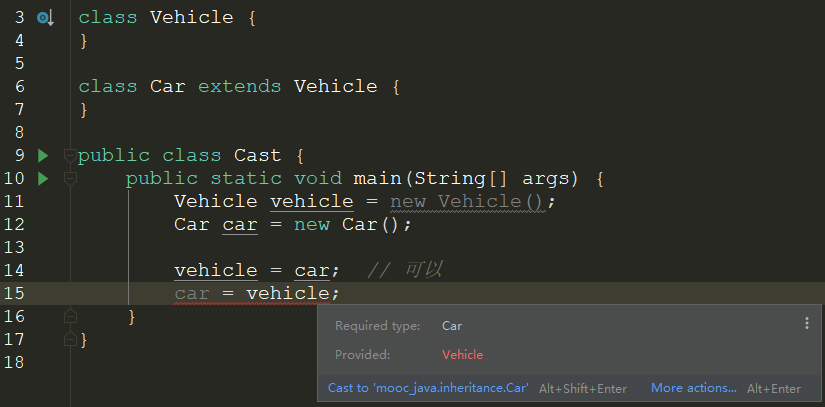
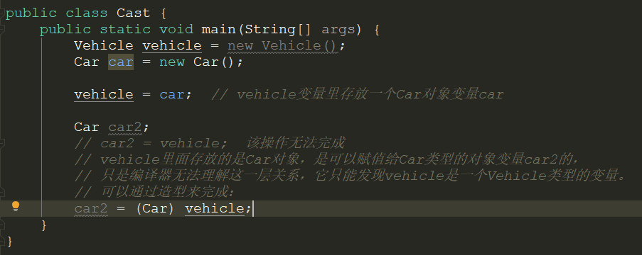
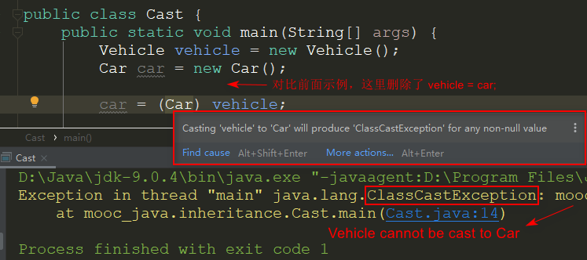
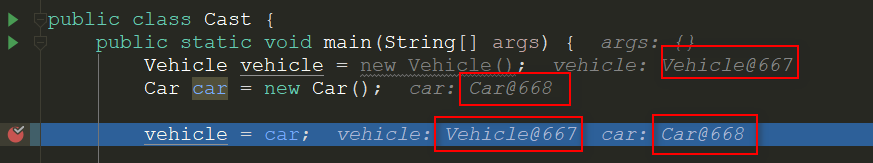
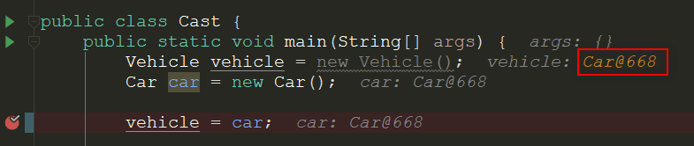

#### 1. 继承

面向对象程序设计语言有三大特性：**封装、继承和多态性**。继承是面向对象语言的重要特征之一，没有继承的语言只能被称作“使用对象的语言”。继承是非常简单而强大的设计思想，它提供了我们代码重用和程序组织的有力工具。

我们把用来做基础派生其它类的那个类叫做父类、超类或者基类，而派生出来的新类叫做子类。Java用关键字**extends表示这种继承/派生**关系：

```java
public ThisClass extends SuperClass {
		// ...
}
```

继承表达了一种is-a关系，就是说，**子类的对象可以被看作是父类的对象**。比如鸡是从鸟派生出来的，因此任何一只都可以被称作是一只鸟。但是反过来不行，有些鸟是鸡，但并不是所有的鸟都是鸡。如果你设计的继承关系，导致当你试图把一个子类的对象看作是父类的对象显然很不合逻辑时，比如你让鸡类从水果类得到继承，然后你试图说：这只鸡是一种水果，所以这鸡煲就像水果色拉。这显然不合逻辑，如果出现这样的问题，那就说明你的类的关系的设计是不正确的。**Java的继承只允许单继承，即一个类只能有一个父类**。

---

####  2. 子类父类关系

**子类和子类型**：

- 类定义了类型
- 子类定义了子类型
- 子类的对象可以被当做父类的对象来使用
  - 赋值给父类的变量
  - 传递给需要父类对象的函数
  - 放进存放父类对象的容器里

---

**子类型与赋值**：

子类的对象可以赋值给父类的变量；



```java
Vehicle v1 = new Vehicle();
Vehicle v2 = new Car();
Vehicle v3 = new Bicycle();
```

---

**子类和参数传递**：

子类的对象可以传递给需要父类对象的函数；

```java
import java.util.ArrayList;

public class Database {
    private ArrayList<BaseItem> listItem = new ArrayList<BaseItem>();

    public void add(BaseItem baseitem) {
        listItem.add(baseitem);
    }

    public void list() {
        for (BaseItem baseitem : listItem) {
            baseitem.print();
        }
    }

    public static void main(String[] args) {
        Database db = new Database();
      	dvd = new DVD("DVD", 60, "comment1", false, "zhu");
      	cd = new CD("CD", 30, "comment2", false, "art", 10);
        db.add(dvd);
        db.add(cd);
        db.list();
    }
}
```

具体的代码：[database](https://gitee.com/zypdominate/keeplearning/tree/master/myLearning/learningJava/src/mooc_java/inheritance)

---

**子类型和容器**：

子类的对象可以放在存放父类对象的容器里；





---

####  3. 多态变量

多态变量：

该变量在程序运行时，在某个时刻，它所管理的对象的类型是会变化的。

- Java的对象变量是多态的，它们能保存不止一种类型的对象；
- 它们可以保存的是声明类型的对象，或声明类型的子类的对象；
- 当把子类的对象赋给父类的变量时，就发生了向上造型；

示例中，变量baseitem的声明类型从字面上可以看出是BaseItem，这是静态的，但是当程序运行到此处时它里面管理的是什么类型的对象，那么它的动态类型就是什么。**每一个java的对象变量都具有两个类型：声明类型、动态类型**，有时可能是一致的，有时不一致。

所以当以下该程序运行时，baseitem得到的可能是CD类型或DVD类型的对象：

```java
public class Database {
    private ArrayList<BaseItem> listItem = new ArrayList<BaseItem>();

    public void add(BaseItem baseitem) {
        listItem.add(baseitem);
    }

    public static void main(String[] args) {
        Database db = new Database();
      	dvd = new DVD("DVD", 60, "comment1", false, "zhu");
      	cd = new CD("CD", 30, "comment2", false, "art", 10);
        db.add(dvd);
        db.add(cd);
    }
}
```

---

#### 4. 向上造型

- 子类的对象可以赋值给父类的变量；

  - 注意：Java中不存在对象对对象的赋值！

- 父类的对象不能赋值给子类的对象！

  

  

  可以使用造型：car = (Car) vechile;  只有当 vechicle 这个变量实际管理的是 Car 才行。

  ```java
  public class Cast {
      public static void main(String[] args) {
        	Vechile vechile = new Vechile();
          Car car = new Car();
     
          vechile = car;  // 可以
          car = (Car) vechile;  // 造型
      }
  }
  ```

  


**造型**：

- 用括号围起类型放在值的前面

- 对象本身并没有发生任何变化（所以不是“类型装换”）

- 运行时有机制来检查这样的转化是否合理；

  通过造型，把一个类型(Vehicle)的变量(vehicle)强制"造型"成另外一个类型(Car)，赋值给另外类型那个对象(car)，并不总是安全的，取决于被"造型"的变量(vehicle)当时实际管理的类型是什么；如果不合理，则会报错：ClassCastException。

  

与**类型装换**的区别：

类型装换和造型是不同的，如 `(int)10.2` 类型转换后10.2不再是10.2而是一个int类型的10；而造型是把被造型的对象看成是另一个类型，并没有改造成另一个类型。

```java
int i = (int)10.2 // 类型装换
```


**向上造型**

- 拿一个子类的对象，当做父类的对象来用；
- 向上造型是默认的，不需要运算符( )；
- 向上造型总是安全的；





---

问题：

有时候事物本身比其第一印象更复杂。考虑一下,矩形和正方形的继承关系是怎样的?

因为从数学上，正方形是一种特殊的矩形。但是，从程序实现上考虑，正方形只要一个边长，而矩形可以从正方形继承后再增加一个边长成员变量。另一方面来说，如果正方形从矩形继承，那么就会出现冗余的第二个边长变量。

怎么看这个事情？

被老师带沟里去了，觉得好像有道理啊：矩形继承正方形，一个变量较多的（矩形）继承一个描述变量较少的（正方形），有利于代码简洁、节约存储空间，但仔细思考后发现可能会带来一些其他的问题。

比如：我们需要向上造型的的时候，把正方形对象交给一个矩形变量是没有问题的，正方形满足矩形的所有特性，可以作为矩形来操作。但是把矩形向上造型交给一个正方形，就有问题，因为矩形并不具有正方形的所有特点（例如各边长相同），将这个矩形对象当作一个正方形对象进行处理，会发生问。

因此，父类和子类应该是在逻辑上具有包含关系（子类是一种特殊的父类，子类具有父类的所有性质），而不仅仅是节约代码和存储空间的一种手段，这样程序的逻辑上才显得通顺。

---

#### 5. 多态

**函数调用的绑定**：

- 当通过对象变量调用函数的时候，调用哪个函数这件事情叫做绑定；
  - 静态绑定：根据变量的声明类型来决定；
  - 动态绑定：根据变量的动态类型来决定；(Java中默认的都是动态绑定)
- 在成员函数中调用其他成员函数也是通过this这个对象变量来调用的；

**覆盖override**：

- 子类和父类中存在名称和参数完全相同的函数，这一对函数构成覆盖关系；
- 通过父类的变量调用存在覆盖关系的函数时，会调用变量当时所管理的对象所属的类的函数；

---

#### 6. Object类

所有的类都是继承自Object的。

