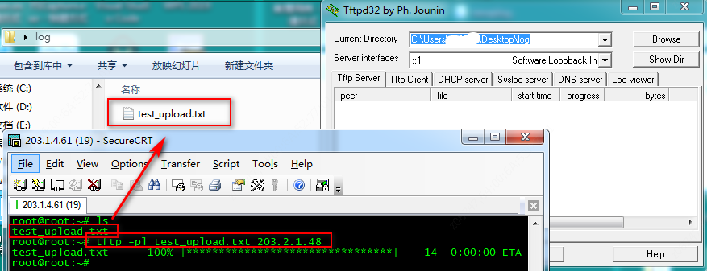
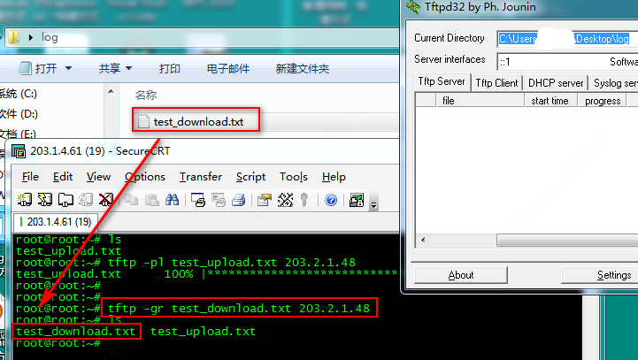

参数说明：
              -l  是local的缩写，后跟存在于Client的源文件名，或下载Client后  重命名的文件名。
              -r   是remote的缩写，后跟Server即PC机tftp服务器根目录中的源文 件名，或上传Server后重命名后的文件名。
              -g  是get的缩写，下载文件时用，
              -p  是put的缩写，上传文件时用，
              tftp 默认占用的是69端口。

示例场景：
当前测试对象是 IPC（telnet下可看成linux操作环境），而办公使用的windows环境，于是有些交互就在linux和windows下了。

我这边使用了telnet工具作为连接
1. IPC（客户端）向windows（服务器）上传文件：
`tftp -pl  file  serverip`  ：在执行这条命令的目录下，有一个file，serverip 这里指windows的IP地址（自己作为client，windows这里就是server了）
例如：将一个test_upload.txt文件上传到windows的某文件中

  
2. 从windows（服务器）下载文件到 IPC（客户端）的当前目录：
`tftp -gr file_path serverip`：（这里file_path指服务器上tftp默认设置的目录里的文件，可以更改 file_path 路径）
例如：将windows的某文件中一个文件下载下来
