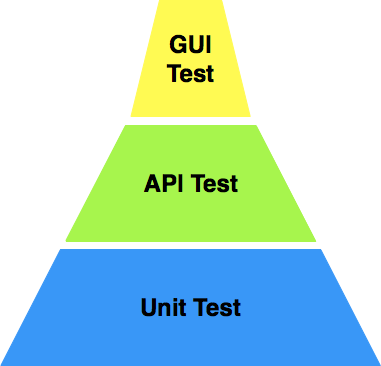
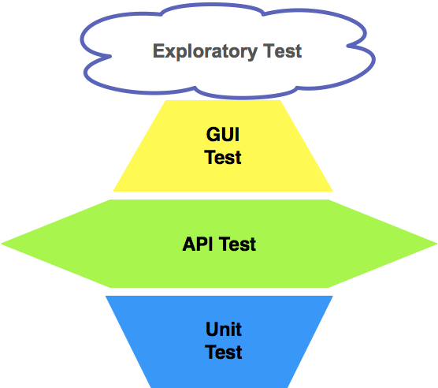

[toc]

### 传统软件产品的测试策略设计

#### 1. 单元测试

金字塔最底部是单元测试，属于白盒测试的范畴，通常由开发工程师自己完成，由于越早发现缺陷其修复成本越低，所以传统软件产品的测试策略提倡对单元测试的高投入，单元测试这一层通常都会做得比较“厚”。

另外，传统软件产品，生命周期都比较长，通常会有多个版本持续发布，为了在后期的版本升级过程中能够尽早发现并快速定位问题，每次 build 过程中都会多次反复执行单元测试，这也从另一个角度反映出单元测试的重要性。

#### 2. API 测试

金字塔中间部分是 API 测试，主要针对的是各模块暴露的接口，通常采用灰盒测试方法。灰盒测试方法是介于白盒测试和黑盒测试之间的一种测试技术，其核心思想是利用测试执行的代码覆盖率来指导测试用例的设计。

以 API 接口测试为例，首先以黑盒方式设计如何调用 API 的测试用例，同时在测试执行过程中统计代码覆盖率，然后根据代码覆盖率情况来补充更多、更有针对性的测试用例。

总体来看，API 测试用例的数量会少于单元测试，但多于上层的 GUI 测试。

#### 3. GUI 测试

金字塔最上层的是 GUI 测试，也称为端到端（E2E，End-to-end）测试，是最接近软件真实用户使用行为的测试类型。通常是模拟真实用户使用软件的行为，即模拟用户在软件界面上的各种操作，并验证这些操作对应的结果是否正确。

GUI 测试的优点是，能够实际模拟真实用户的行为，直接验证软件的商业价值；缺点是执行的代价比较大，就算是采用 GUI 自动化测试技术，用例的维护和执行代价依然很大。所以，要尽可能地避免对 GUI 测试的过度依赖。

另外，GUI 测试的稳定性问题，是长期以来阻碍 GUI 测试发展的重要原因。即使采用了很多诸如 retry 机制以及异常场景恢复机制等方式，GUI 测试的随机失败率依旧高居不下。

---

### 互联网产品的测试策略设计

对于互联网产品来说，金字塔模型已经不再适用。

#### 1. GUI测试

互联网产品的上线周期，决定了 GUI 测试不可能大范围开展。

互联网产品的迭代周期，决定了留给开发 GUI 自动化测试用例的时间非常有限；

互联网产品客户端界面的频繁变化，决定了开展 GUI 自动化测试的效率会非常低，这也是最糟糕的。

因为敏捷模式下的快速反馈，在下一个迭代可能就需要根据反馈来做修改和调整客户端界面，那么刚开发完，甚至是还没开发完的 GUI 自动化测试用例就要跟着一起修改。这种频繁地修改，对开发 GUI 自动化测试是非常不利的。因为，刚开发完的自动化用例只跑了一次，甚至是一次还没来得及跑就需要更新了，导致 GUI 自动化测试还不如手工测试的效率高。

互联网产品的 GUI 测试通常采用“**手工为主，自动化为辅**”的测试策略，手工测试往往利用**探索性测试思想**，针对新开发或者新修改的界面功能进行测试，而自动化测试的关注点主要放在相对稳定且核心业务的基本功能验证上。所以，GUI 的自动化测试往往只覆盖最核心且直接影响主营业务流程的端到端场景。

从 GUI 测试用例的数量来看，传统软件的 GUI 测试属于重量级的，动不动就有上千个用例，因为传统软件的测试周期很长，测试用例可以轮流排队慢慢执行，时间长点也没关系。而互联网产品要求 GUI 测试是轻量级的，产品的上线周期，直接决定了不允许你去执行大量的用例。

#### 2. API测试

对于互联网产品来说，把测试重点放在 API 测试上。

1. API 测试用例的开发与调试效率比 GUI 测试要高得多，而且测试用例的代码实现比较规范，通常就是准备测试数据，发起 request，验证 response 这几个标准步骤。

2. API 测试用例的执行稳定性远远高于 GUI 测试。 GUI 测试执行的稳定性始终是难题，即使你采用了很多技术手段，它也无法做到 100% 的稳定。

   而 API 测试天生就没有执行稳定性的问题，因为测试执行过程不依赖于任何界面上的操作，而是直接调用后端 API，且调用过程比较标准。

3. 单个 API 测试用例的执行时间往往要比 GUI 测试短很多。当有大量 API 测试需要执行时，API 测试可以很方便地以并发的方式执行，所以可以在短时间内完成大批量 API 测试用例的执行。
4. 现在很多互联网产品采用了微服务架构，而对微服务的测试，本质上就是对不同的 Web Service 的测试，也就是 API 测试。在微服务架构下，客户端应用的实现都是基于对后端微服务的调用，如果做好了每个后端服务的测试，就会对应用的整体质量有充分的信心。所以，互联网产品的 API 测试非常重要。
5. API 接口的改动一般比较少，即使有改动，绝大多数情况下也需要保证后向兼容性。所谓后向兼容性，最基本的要求就是保证原本的 API 调用方式维持不变。显然，如果调用方式没有发生变化，那么原本的 API 测试用例也就不需要做大的改动，这样用例的可重用性就很高，进而可以保证较高的投入产出比。

互联网产品的这些特性决定了，API 测试可以实现良好的投入产出比，因此应该成为互联网产品的测试重点。这也就是为什么互联网产品的测试策略更像是个菱形结构的原因。

它遵循“**重量级 API 测试，轻量级 GUI 测试，轻量级单元测试**”的原则。

#### 3. 单元测试

从理论上讲，无论是传统软件产品还是互联网产品，单元测试都是从源头保证软件质量的重要手段，因此都非常重要。但现实是，互联网产品真正能全面开展单元测试，并严格控制代码覆盖率的企业还是凤毛麟角。

但凡存在的都会有其合理性，最主要的原因还是在于互联网产品的“快”，快速实现功能，快速寻求用户反馈，快速试错，快速迭代更新。

在这样的模式下，互联网产品追求的是最快速的功能实现并上线，基本不会给你时间去做全面的单元测试。即使给预留了单元测试的时间，频繁的迭代也会让单元测试处于不断重写的状态。因此，单元测试原本的价值，很难在实际操作层面得到体现。

互联网产品通常会分为应用层和后端服务，后端服务又可以进一步细分为应用服务和基础服务。

后端基础服务和一些公共应用服务相对稳定，而且对于系统全局来说是“牵一发而动全身”，所以后端服务很有必要开展全面的单元测试；而对于变动非常频繁的客户端应用和非公用的后端应用服务，一般很少会去做单元测试。

另外，对于一些核心算法和关键应用，比如银行网关接口，第三方支付集成接口等，也要做比较全面的单元测试。

总结来讲，互联网产品的全面单元测试只会应用在那些相对稳定和最核心的模块和服务上，而应用层或者上层业务服务很少会大规模开展单元测试。