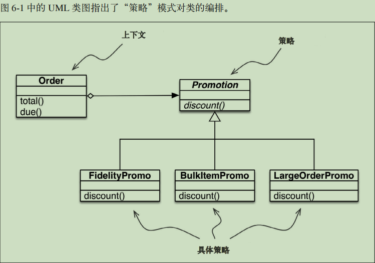

## 把函数视作对象 - 使用一等函数实现设计模式

《设计模式：可复用面向对象软件的基础》一书是这样概述“**策略**”模式的：**定义一系列算法，把它们一一封装起来，并且使它们可以相互替换。本模式使得算法可以独立于使用它的客户而变化。**


#### 1. 经典的“策略”模式

电商领域有个功能明显可以使用“策略”模式，即根据客户的属性或订单中的商品计算折扣。假如一个网店制定了下述折扣规则。 

1. 有 1000 或以上积分的顾客，每个订单享 5% 折扣。 
2. 同一订单中，单个商品的数量达到 20 个或以上，享 10% 折扣。
3.  订单中的不同商品达到 10 个或以上，享 7% 折扣。
4. (简单起见，我们假定一个订单一次只能享用一个折扣。)


上下文: 把一些计算委托给实现不同算法的可互换组件，它提供服务。在这个电商示例中，上下文是 Order，它会根据不同的算法计算促销折扣。 

策略:  实现不同算法的组件共同的接口。在这个示例中，名为 Promotion 的抽象类扮演这个角色。 

具体策略:  “策略”的具体子类。fidelityPromo、BulkPromo 和 LargeOrderPromo 是这里实现的三个具体策略。



```python
from abc import ABC, abstractmethod
from collections import namedtuple

Customer = namedtuple('Customer', 'name fidelity')


class LineItem(object):
    def __init__(self, product, quantity, price):
        self.product = product
        self.quantity = quantity
        self.price = price

    def total(self):
        return self.price * self.quantity


class Order(object):
    def __init__(self, customer, cart, promotion=None):
        self.customer = customer
        self.cart = cart
        self.promotion = promotion

    def total(self):
        if not hasattr(self, '__total'):
            self.__total = sum(item.total() for item in self.cart)
        return self.__total

    def due(self):
        if self.promotion is None:
            discount = 0
        else:
            discount = self.promotion.discount(self)
        return self.total() - discount

    def __repr__(self):
        fmt = f'<Order total:{self.total()}, due:{self.due()}>'
        return fmt


class Promotion(ABC):
    @staticmethod
    def discount(self, order):
        """返回折扣金额"""


class FidelityPromo(Promotion):
    """1000积分以上顾客，5%折扣"""

    def discount(self, order):
        return order.total() * 0.05 if order.customer.fidelity >= 1000 else 0


class BulkItemPromo(Promotion):
    """单个商品20个以上，10%折扣"""

    def discount(self, order):
        discount = 0
        for item in order.cart:
            if item.quantity >= 20:
                discount += item.total * 0.1
        return discount


class LargeOrderPromo(Promotion):
    """不同商品10个以上，7%折扣"""

    def discount(self, order):
        distinct_items = {item.product for item in order.cart}
        if len(distinct_items) >= 10:
            return order.total() * 0.07
        return 0

joe = Customer('John Doe', 0)
ann = Customer('Ann Smith', 1100)
cart = [LineItem('banana', 4, .5), LineItem('apple', 10, 1.5), LineItem('watermellon', 5, 5.0)]
Order(joe, cart, FidelityPromo())
 # <Order total: 42.00 due: 42.00>
Order(ann, cart, FidelityPromo())
 # <Order total: 42.00 due: 39.90>
banana_cart = [LineItem('banana', 30, .5), LineItem('apple', 10, 1.5)]
Order(joe, banana_cart, BulkItemPromo())
 # <Order total: 30.00 due: 28.50>
long_order = [LineItem(str(item_code), 1, 1.0) for item_code in range(10)]
Order(joe, long_order, LargeOrderPromo())
 # <Order total: 10.00 due: 9.30>
Order(joe, cart, LargeOrderPromo())
```

分析：每个具体策略都是一个类，而且都只定义了一个方法，即 discount。此外，策略实例没有状态（没有实例属性）。你可能会说，它们看起来像是普通的函数——的确如此。以下示例是对上例的重构，把具体策略换成了简单的函数，而且去掉了 Promo抽象类。

没必要在新建订单时实例化新的促销对象，函数拿来即用。

#### 2. 使用函数实现“策略”模式

```python
from abc import ABC, abstractmethod
from collections import namedtuple

Customer = namedtuple('Customer', 'name fidelity')

class LineItem(object):
    def __init__(self, product, quantity, price):
        self.product = product
        self.quantity = quantity
        self.price = price

    def total(self):
        return self.price * self.quantity


class Order(object):
    def __init__(self, customer, cart, promotion=None):
        self.customer = customer
        self.cart = cart
        self.promotion = promotion

    def total(self):
        if not hasattr(self, '__total'):
            self.__total = sum(item.total() for item in self.cart)
        return self.__total

    def due(self):
        if self.promotion is None:
            discount = 0
        else:
            discount = self.promotion(self)  # 计算折扣只需调用self.promotion()函数。
        return self.total() - discount

    def __repr__(self):
        fmt = f'<Order total:{self.total()}, due:{self.due()}>'
        return fmt


# 没有抽象类
def fidelity_promo(order):  # 各个策略都是函数
    """1000积分以上顾客，5%折扣"""
    return order.total() * 0.05 if order.customer.fidelity >= 1000 else 0

# 没必要在新建订单时实例化新的促销对象，函数拿来即用。
def bulk_item_promo(order):
    """单个商品20个以上，10%折扣"""
    discount = 0
    for item in order.cart:
        if item.quantity >= 20:
            discount += item.total() * 0.1
    return discount


def large_order_promo(order):
    """不同商品10个以上，7%折扣"""
    distinct_items = {item.product for item in order.cart}
    if len(distinct_items) >= 10:
        return order.total() * 0.07
    return 0


joe = Customer('John Doe', 0)
ann = Customer('Ann Smith', 1100)
cart = [LineItem('banana', 4, .5), LineItem('apple', 10, 1.5), LineItem('watermellon', 5, 5.0)]

Order(joe, cart, fidelity_promo)  # 没必要在新建订单时实例化新的促销对象，函数拿来即用。
# <Order total: 42.00 due: 42.00>
Order(ann, cart, fidelity_promo)
# <Order total: 42.00 due: 39.90>

banana_cart = [LineItem('banana', 30, .5), LineItem('apple', 10, 1.5)]
Order(joe, banana_cart, bulk_item_promo)
# <Order total: 30.00 due: 28.50>
long_order = [LineItem(str(item_code), 1, 1.0) for item_code in range(10)]
Order(joe, long_order, large_order_promo)
# <Order total: 10.00 due: 9.30>
Order(joe, cart, large_order_promo)
# <Order total:42.0, due:42.0>
```


值得注意的是，《设计模式：可复用面向对象软件的基础》一书的作者指出：“策略对象通常是很好的享元（flyweight）。”那本书的另一部分对“享元”下了定义：“**享元**是可共享的对象，可以同时在多个上下文中使用。” 共享是推荐的做法，这样不必在每个新的上下文（这里是 Order 实例）中使用相同的策略时不断新建具体策略对象，从而减少消耗。因此，为了避免“策略”模式的一个缺点（运行时消耗），《设计模式：可复用面向对象软件的基础》的作者建议再使用另一个模式。但此时，代码行数和维护成本会不断攀升。

在复杂的情况下，需要具体策略维护内部状态时，可能需要把“**策略**”和“**享元**”模式结合起来。但是，**具体策略一般没有内部状态，只是处理上下文中的数据**。此时，一定要使用普通的函数，别去编写只有一个方法的类，再去实现另一个类声明的单函数接口。函数比用户定义的类的实例轻量，而且无需使用“享元”模式，因为各个策略函数在 Python 编译模块时只会创建一次。**普通的函数也是“可共享的对象，可以同时在多个上下文中使用”**。


#### 3. 选择最佳策略：简单的方式

```python
promo_list = [fidelity_promo, bulk_item_promo, large_order_promo]
def best_promo(order):
    """
    与其他几个 *_promo 函数一样，best_promo 函数的参数是一个Order实例;
    使用生成器表达式把 order 传给 promos 列表中的各个函数，
    返回折扣额度最大的那个函数。
    """
    return max(promo(order) for promo in promo_list)
```

promos 是函数列表。习惯函数是一等对象后，自然而然就会构建那种数据结构存储函数。

该例可用，而且易于阅读，但是有些重复可能会导致不易察觉的缺陷：若想添加新的促销策略，要定义相应的函数，还要记得把它添加到 promos 列表中；否则，当新促销函数显式地作为参数传给 Order 时，它是可用的，但是 best_promo 不会考虑它。


#### 4. 找出模式中的全部策略

**globals()** 返回一个字典，表示当前的全局符号表。这个符号表始终针对当前模块（对函数或方法来说，是指定义它们的模块，而不是调用它们的模块）。

```python
# test.py
def test1():
    pass

class Test2(object):
    def test3(self):
        pass

for i in list(globals()):
    print(i)
```

```
__name__
__doc__
__package__
__loader__
__spec__
__annotations__
__builtins__
__file__
__cached__
test1
Test2
```

在上例中修改：迭代 globals() 返回字典中的各个 name，只选择以 _promo 结尾的名称，过滤掉 best_promo 自身，防止无限递归，best_promo 内部的代码没有变化。

```python
# 选择最佳策略：方法二
promo_list2 = [globals()[name] for name in globals()
          if name.endswith('_promo') and name != 'best_promo']
def best_promo2(order):
    # 选择可用的最佳折扣
    return max(promo(order) for promo in promo_list2)

print(Order(joe, banana_cart, bulk_item_promo))
print(Order(joe, long_order, large_order_promo))
print(Order(joe, cart, best_promo2))
# <Order total:30.0, due:28.5>
# <Order total:10.0, due:9.3>
# <Order total:42.0, due:42.0>
```

