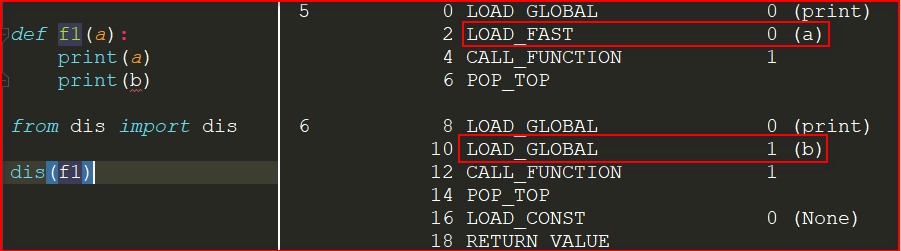
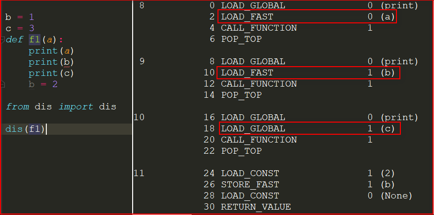
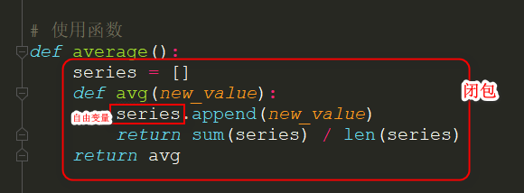

##  函数装饰器和闭包

####  1.基础

函数装饰器用于在源码中“标记”函数，以某种方式增强函数的行为。这是一项强大的功能，但是若想掌握，必须理解闭包。

**装饰器是可调用的对象**，其参数是另一个函数（被装饰的函数）。**装饰器可能会处理被装饰的函数，然后把它返回，或者将其替换成另一个函数或可调用对象。**

demo：

```python
def decor(func):
    def inner():
        print("innner")
    return inner  # 返回inner函数对象

@decor
def test():  # 用deco装饰test
    print("test func")

test()
# innner

# 以上相当于：
def decor(func):
    def inner():
        print("innner")
    return inner

def test():
    print("test func")

test = decor(test)
test()
```

严格来说，**装饰器只是语法糖**。如前所示，装饰器可以像常规的可调用对象那样调用，其参数是另一个函数。有时，这样做更方便，尤其是做元编程（在运行时改变程序的行为）时。

综上，装饰器的一大特性是，**能把被装饰的函数替换成其他函数**。第二个特性是，**装饰器在加载模块时立即执行**。

---

#### 2. Python何时执行装饰器

装饰器的一个关键特性是，它们**在被装饰的函数定义之后立即运行**。这通常是在**导入**时（即 Python **加载模块**时）。

```python
# registration.py
registry_list = []

def register(func):
    print(f'running register {func}')
    registry_list.append(func)
    return func

@register
def f1():
    print(f'running f1()')

@register
def f2():
    print(f'running f2()')

def f3():
    print(f'running f3()')

def main():
    print('running main()')
    print(f'registry_list:{registry_list}')
    f1()
    f2()
    f3()

if __name__ == '__main__':
    main()
```

把 registration.py 当作脚本运行得到的输出如下：

```
$ python3 registration.py
running register <function f1 at 0x000001EECF194F28>
running register <function f2 at 0x000001EED61FA378>
running main()
registry_list:[<function f1 at 0x000001EECF194F28>, <function f2 at 0x000001EED61FA378>]
running f1()
running f2()
running f3()
```

register 在模块中其他函数之前运行（两次）。调用 register 时，传给它的参数是

被装饰的函数，例如<function f1 at 0x000001EECF194F28>。

加载模块后，registry 中有两个被装饰函数的引用：f1 和 f2。这两个函数，以及 f3，只在 main 明确调用它们时才执行。

如果导入 registration.py 模块（不作为脚本运行），输出如下：

```
>>>import registration
running register <function f1 at 0x000002494681A400>
running register <function f2 at 0x000002494681A488>
```

此时查看 registry 的值，得到的输出如下：	

```
>>> registration.registry
[<function f1 at 0x000002494681A400>, <function f2 at 0x000002494681A488>]
```

虽然示例中的 register 装饰器原封不动地返回被装饰的函数，但是这种技术并非没有用处。很多 Python Web 框架使用这样的装饰器把函数添加到某种中央注册处，例如把URL 模式映射到生成 HTTP 响应的函数上的注册处。

通过上例可以得出结论：**函数装饰器在导入模块时立即执行，而被装饰的函数只在明确调用时运行。**

考虑到装饰器在真实代码中的常用方式，上例有两个不寻常的地方：

- 装饰器函数与被装饰的函数在同一个模块中定义。实际情况是，**装饰器通常在一个模块中定义，然后应用到其他模块中的函数上。**
- register 装饰器返回的函数与通过参数传入的相同。实际上，**大多数装饰器会在内部定义一个函数，然后将其返回。**

---

#### 3. 使用装饰器改进“策略”模式

```python
# 选择最佳策略(使用装饰器)
promo_list = []

def promotion(promo_func):
  	"""promotion 把 promo_func 添加到promo_list中，然后原封不动地将其返回。"""
    promo_list.append(promo_func)
    return promo_func

@promotion  # 被 @promotion 装饰的函数都会添加到promo_list中。
def fidelity_promo(order):
    """1000积分以上顾客，5%折扣"""
    return order.total() * 0.05 if order.customer.fidelity >= 1000 else 0

@promotion
def bulk_item_promo(order):
    """单个商品20个以上，10%折扣"""
    discount = 0
    for item in order.cart:
        if item.quantity >= 20:
            discount += item.total() * 0.1
    return discount

@promotion
def large_order_promo(order):
    """不同商品10个以上，7%折扣"""
    distinct_items = {item.product for item in order.cart}
    if len(distinct_items) >= 10:
        return order.total() * 0.07
    return 0

def best_promo(order):  # best_promos无需修改，它依赖promo_list
    """
    与其他几个 *_promo 函数一样，best_promo 函数的参数是一个Order实例;
    使用生成器表达式把 order 传给 promos 列表中的各个函数，
    返回折扣额度最大的那个函数。
    """
    return max(promo(order) for promo in promo_list)
```

与之前给出的方案相比，这个方案有几个优点：

- 促销策略函数无需使用特殊的名称（即不用以 _promo 结尾）。

- @promotion 装饰器突出了被装饰的函数的作用，还便于临时禁用某个促销策略：只需把装饰器注释掉。
- 促销折扣策略可以在其他模块中定义，在系统中的任何地方都行，只要使用 @promotion装饰即可。

不过，多数装饰器会修改被装饰的函数。通常，它们会定义一个内部函数，然后将其返回，替换被装饰的函数。使用内部函数的代码几乎都要靠闭包才能正确运作。

---

#### 4. 变量作用域规则

先看一个demo：

```python
>>> b = 1
>>> def f1(a):
      print(a)
      print(b)
      b = 2
      
>>> f1(0)
0
Traceback (most recent call last):
  File "<pyshell#9>", line 1, in <module>
    f1(0)
  File "<pyshell#8>", line 3, in f1
    print(b)
UnboundLocalError: local variable 'b' referenced before assignment
```

Python 编译函数的定义体时，它判断 b 是局部变量，因为在函数中给它赋值了。生成的字节码证实了这种判断，Python 会尝试从本地环境获取 b。后面调用 f1(0) 时，f1 的定义体会获取并打印局部变量 a 的值，但是尝试获取局部变量 b 的值时，发现 b 没有绑定值。

如果在函数中赋值时想让解释器把 b 当成**全局变量**，要使用 **global** 声明。

```python
>>> def f1(a):
      global b
      print(a)
      print(b)
      b = 2
      
>>> f1(0)
0
1
```

比较字节码：**dis 模块为反汇编 Python 函数字节码提供了简单的方式**

一个函数，读取一个局部变量和一个全局变量：



b是局部变量，因为在函数的定义体中给它赋值了：



这里的`LOAD_GLOBAL  1 (b)`：加载本地名称 b，这表明，编译器把 b 视作局部变量，即使在后面才为 b 赋值，因为变量的种类（是不是局部变量）不能改变函数的定义体。

---

#### 5. 闭包

闭包指延伸了作用域的函数，其中包含函数定义体中引用、但是不在定义体中定义的非全局变量。函数是不是匿名的没有关系，关键是它能访问定义体之外定义的非全局变量。

假如有个名为 avg 的函数，它的作用是计算不断增加的系列值的均值：

```python
# 使用class
class Avg(object):
    def __init__(self):
        self.series = []
    
    def __call__(self, newvalue):
        self.series.append(newvalue)
        return sum(self.series)/len(self.series)

avg = Avg()
print(avg(1))
print(avg(3))


# 使用函数
def average():
    series = []
    def avg(new_value):
        series.append(new_value)
        total = sum(series)
        return total / len(series)
    return avg

avg2 = average()
print(avg2(3))  # 3.0
print(avg2(9))  # 6.0
```



**avg 的闭包延伸到那个函数的作用域之外，包含自由变量 series 的绑定。**

审查返回的 averager 对象，我们发现 Python 在` __code__ `属性（表示编译后的函数定义体）中保存局部变量(co_varnames)和自由变量(co_freevars)的名称。

```python
avg2.__code__.co_varnames  # ('new_value', 'total')
avg2.__code__.co_freevars  # ('series',)
```

series 的绑定在返回的 avg2 函数的` __closure__ `属性中。`avg2.__closure__ `中的各个元素对应于 `avg2.__code__.co_freevars `中的一个名称。这些元素是 cell 对象，有个 cell_contents 属性，保存着真正的值。

```python
print(avg2.__closure__[0].cell_contents)  # [3, 9]
```

综上，**闭包是一种函数，它会保留定义函数时存在的自由变量的绑定，这样调用函数时，虽然定义作用域不可用了，但是仍能使用那些绑定**。注意，**只有嵌套在其他函数中的函数才可能需要处理不在全局作用域中的外部变量**。

---

#### 6. nonlocal声明

之前我们把所有值存储在历史数列中，然后在每次调用 avg时使用 sum 求和。更好的实现方式是，只存储目前的总值和元素个数，然后使用这两个数计算均值。

```python
# 计算移动平均值的高阶函数，不保存所有历史值，但有bug
def average():
    total = count = 0
    def avg(new_var):
        total += new_var
        count += 1
        return total / count
    return avg

avg = average()
print(avg(2))
print(avg(8))
```

如果是用pycharm编码，这里有红色的波浪线直接提示报错（`This inspection detects names that should resolve but don't. Due to dynamic dispatch and duck typing, this is possible in a limited but useful number of cases. Top-level and class-level items are supported better than instance items.`）， 强行执行后报错:`UnboundLocalError: local variable 'summary' referenced before assignment`

问题是，当 count 是数字或任何不可变类型时，count += 1 语句的作用其实与 count = count + 1 一样。因此，**在 averager 的定义体中给 count 赋值时，会将 count 变成局部变量**。total 变量也受这个问题影响。

之前没遇到这个问题，因为没有给 series 赋值，我们只是调用 series.append，并把它传给 sum 和 len。也就是说，我们利用了**列表是可变的对象**这一事实。

但是对数字、字符串、元组等不可变类型来说，只能读取，不能更新。如果尝试重新绑定，例如 count = count + 1，其实会隐式创建局部变量 count。这样，count 就不是自由变量了，因此不会保存在闭包中。

为了解决这个问题，Python3 引入了 **nonlocal 声明**。它的作用是把变量标记为自由变量，即使在函数中为变量赋予新值了，也会变成自由变量。如果为 nonlocal 声明的变量赋予新值，闭包中保存的绑定会更新。

```python
def average():
    total = count = 0
    def avg(new_var):
        nonlocal total, count
        total += new_var
        count += 1
        return total / count
    return avg
```

