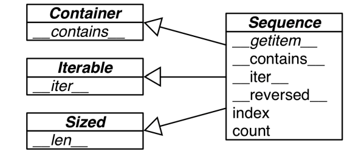
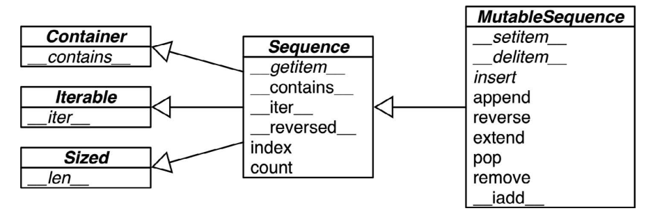
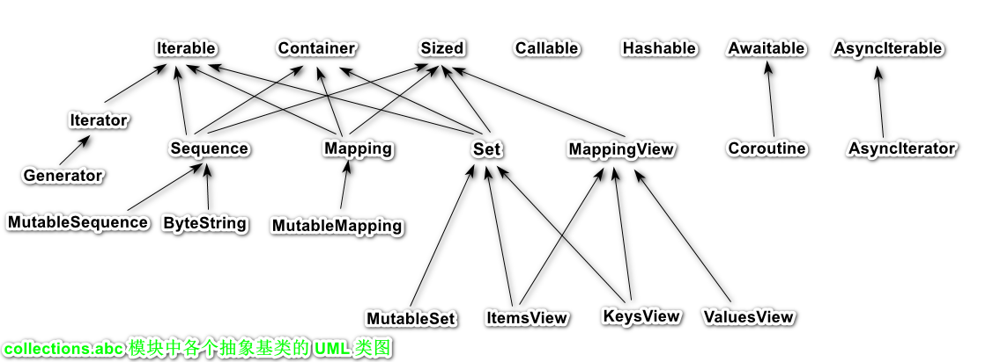
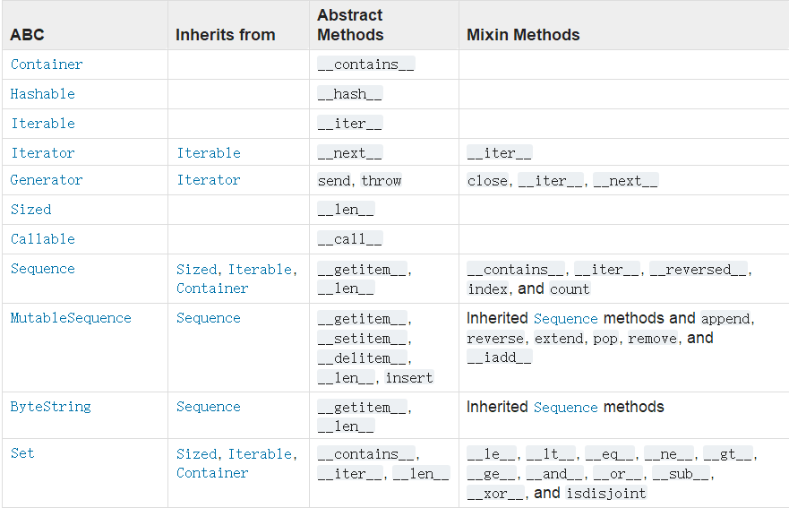
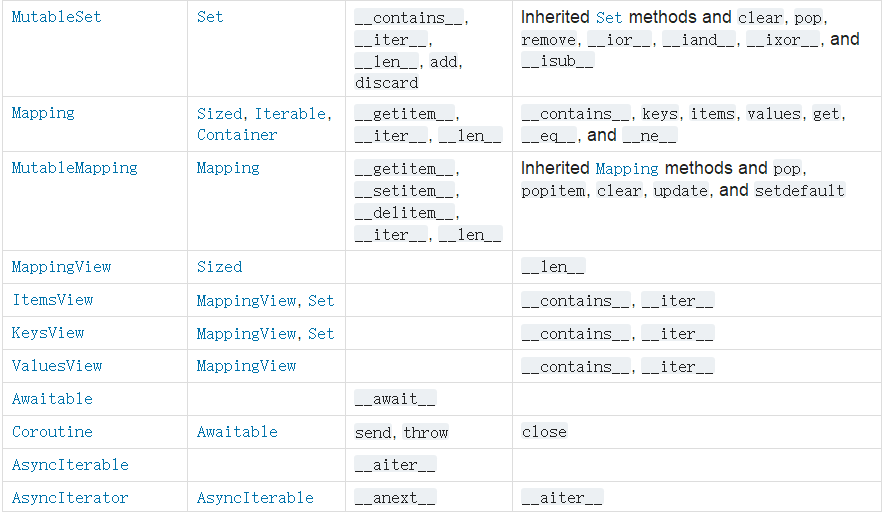

## 接口: 从协议到抽象基类

#### 1. 序列

定义为抽象基类的 Sequence 正式接口：	



Sequence 抽象基类和 collections.abc 中相关抽象类的 UML 类图，箭头由子类指向超类，以斜体显示的是抽象方法。

demo：

类Foo，它没有继承 abc.Sequence，而且只实现了序列协议的一个方法：`__getitem__`（没有实现 `__len__` 方法），这样足够访问元素、迭代和使用 in 运算符了。

如果没有 `__iter__` 和 `__contains__` 方法，Python 会调用`__getitem__` 方法，设法让迭代和 in 运算符可用。

```python
>>> class Foo:
	def __getitem__(self, pos):
		return range(0, 30, 10)[pos]

>>> f = Foo()
>>> f[1]
10
>>> for i in f:
	print(i)
0
10
20
>>> 20 in f
True
>>> 15 in f
False
```

第 1 章定义的 FrenchDeck 类也没有继承 abc.Sequence，但是实现了序列协议的两个方法`__getitem__` 和 `__len__`。

```python
import collections
Card = collections.namedtuple('Card', ['rank', 'suit'])

class FrenchDeck:
    ranks = [str(n) for n in range(2, 11)] + list('JQKA')
    suits = 'spades diamonds clubs hearts'.split()  # 黑桃 方块 梅花 红心

    def __init__(self):
        self._cards = [Card(rank, suit) for suit in self.suits
                       for rank in self.ranks]

    def __len__(self):
        return len(self._cards)

    def __getitem__(self, position):
        return self._cards[position]
```

---

#### 2. 猴子补丁

使用猴子补丁在运行时实现协议。

FrenchDeck 类有个大缺陷：无法洗牌，如果尝试使用shuffle打乱 FrenchDeck 实例，会出现异常。

```python
>>> from random import shuffle
>>> l = list(range(10))
>>> l
[0, 1, 2, 3, 4, 5, 6, 7, 8, 9]
>>> shuffle(l)
>>> l
[8, 6, 0, 5, 2, 1, 9, 7, 3, 4]
```

```python
>>> deck = FrenchDeck()
>>> 
>>> shuffle(deck)
Traceback (most recent call last):
  File "<pyshell#54>", line 1, in <module>
    shuffle(deck)
  File "D:\Python3.6.0\lib\random.py", line 274, in shuffle
    x[i], x[j] = x[j], x[i]
TypeError: 'FrenchDeck' object does not support item assignment
```

报错原因是，shuffle 函数要调换集合中元素的位置，而FrenchDeck 只实现了不可变的序列协议。可变的序列还必须提供 `__setitem__` 方法。Python 是动态语言，因此我们可以在运行时修正这个问题，甚至还可以在交互式控制台中。

为 FrenchDeck 打猴子补丁，把它变成可变的，让 random.shuffle 函数能处理：

```python
>>> def set_card(self, position, card):
	self._cards[position] = card

>>> FrenchDeck.__setitem__ = set_card
>>> shuffle(deck)
>>> deck[:5]
[Card(rank='A', suit='hearts'), Card(rank='5', suit='diamonds'), Card(rank='6', suit='spades'), Card(rank='6', suit='clubs'), Card(rank='3', suit='diamonds')]
```

特殊方法 `__setitem__ ` 中默认用的参数是 self、key 和 value，而这里使用的是 self、position 和 card。这么做是为了表达：每个 Python 方法说到底都是普通函数，把第一个参数命名为 self 只是一种约定。在控制台会话中使用那几个参数没问题，不过在 Python 源码文件中最好按照文档那样使用 self、key 和 value。

这里的关键是，set_card 函数要知道 deck 对象有一个名为 `_cards` 的属性，而且 `_cards` 的值必须是可变序列。然后，把 set_card 函数赋值给特殊方法 `__setitem__`，从而把它依附到 FrenchDeck 类上。这种技术叫**猴子补丁：在运行时修改类或模块，而不改动源码。**猴子补丁很强大，但是打补丁的代码与要打补丁的程序耦合十分紧密，而且往往要处理隐藏和没有文档的部分。

示例还说明了协议是动态的：random.shuffle 函数不关心参数的类型，只要那个对象实现了部分可变序列协议即可。即便对象一开始没有所需的方法也没关系，后来再提供也行。

本章讨论的主题是**“鸭子类型”：对象的类型无关紧要，只要实现了特定的协议即可**。

---

#### 3. 定义抽象基类的子类

这里先利用现有的抽象基类（collections.MutableSequence），然后再自己定义。在示例中，明确把 FrenchDeck2 声明为 collections.MutableSequence 的子类。

```python
import collections
Card = collections.namedtuple('Card', ['rank', 'suit'])

class FrenchDeck2(collections.MutableSequence):
    ranks = [str(n) for n in range(2, 11)] + list('JQKA')
    suits = 'spades diamonds clubs hearts'.split()  # 黑桃 方块 梅花 红心

    def __init__(self):
        self._cards = [Card(rank, suit) for suit in self.suits
                       for rank in self.ranks]

    def __len__(self):
        return len(self._cards)

    def __getitem__(self, position):
        return self._cards[position]

    # 为了支持洗牌，只需要实现__setitem__方法
    def __setitem__(self, position, value):
        self._cards[position] = value

    # 继承MutableSequence类，必须实现它的一个抽象方法__delitem__
    def __delitem__(self, position):
        del self._cards[position]

    # 还要实现 insert 方法，这是 MutableSequence 类的第三个抽象方法。
    def insert(self, position, value):
        self._cards.insert(position, value)

french = FrenchDeck2()
```

导入时（加载并编译 上述代码所在的 模块时），Python 不会检查抽象方法的实现，在运行时实例化 FrenchDeck2 类时才会真正检查。如果没有正确实现某个抽象方法，Python 会抛出 TypeError 异常：`TypeError: Can't instantiate abstract class FrenchDeck2 with abstract methods __delitem__, __setitem__, insert`。正是这个原因，即便 FrenchDeck2 类不需要 `__delitem__` 和 `insert` 提供的行为，也要实现，因为 MutableSequence 抽象基类需要它们。

Sequence 和 MutableSequence 抽象基类的方法不全是抽象的：
下面是MutableSequence 抽象基类和 collections.abc 中它的超类的 UML 类图（箭头由子类指向祖先；以斜体显示的名称是抽象类和抽象方法）。

FrenchDeck2 从 Sequence 继 承 了 几 个 拿 来 即 用 的 具 体 方 法：`__contains__` 、`__iter__`、 `__reversed__`、`index` 和 `count` 。FrenchDeck2 从 MutableSequence 继 承 了 `append`、`extend`、
`pop`、`remove` 和 `__iadd__`。

---

#### 4. 标准库中的基类

从 Python 2.6 开始，标准库提供了抽象基类。大多数抽象基类在 collections.abc 模块中定义，不过其他地方也有。例如，numbers 和 io 包中有一些抽象基类。但是，collections.abc 中的抽象基类最常用。

标准库中有两个名为 abc 的模块，这里说的是 collections.abc。为了减少加载时间，Python 3.4 在 collections 包之外实现这个模块（在 `Lib/_collections_abc.py `中 https://hg.python.org/cpython/file/3.4/Lib/_collections_abc.py ），因此要与 collections 分开导入。另一个 abc 模块就是 abc（即 `Lib/abc.py`，https://hg.python.org/cpython/file/3.4/Lib/abc.py），这里定义的是 abc.ABC 类。每个抽象基类都依赖这个类，但是不用导入它，除非定义新抽象基类。

######  (1) collections.abc 模块中的抽象基类

Python 3.5 在 collections.abc 模块中定义了 22 个抽象基类，简要的 UML 类图（没有属
性名称）。collections.abc 的官方文档中有个不错的表格（https://docs.python.org/3.7/library/collections.abc.html#collections-abstract-base-classes），对各个抽象基类做了总结，说明了相互之间的关系，以及各个基类提供的抽象方法和具体方法（称为“混入方法”）。图中有很多多重继承。



1. **Iterable、Container 和 Sized**
   各个集合应该继承这三个抽象基类，或者至少实现兼容的协议。Iterable 通过 `__iter__` 方法支持迭代，Container 通过 `__contains__` 方法支持 in 运算符，Sized 通过 `__len__` 方法支持 len() 函数。

2. **Sequence、Mapping 和 Set**

   这三个是主要的不可变集合类型，而且各自都有可变的子类。

3. **MappingView**

   在 Python 3 中，映射方法 .items()、.keys() 和 .values() 返回的对象分别是 ItemsView、KeysView 和 ValuesView 的实例，前两个类还从 Set 类继承了丰富的接口。

4. **Callable 和 Hashable**

   这两个抽象基类与集合没有太大的关系，只不过因为 collections.abc 是标准库中定义抽象基类的第一个模块，而它们又太重要了，因此才把它们放到 collections.abc 模块中。基本未见过 Callable 或 Hashable 的子类。这两个抽象基类的主要作用是为内置函数 isinstance 提供支持，以一种安全的方式判断对象能不能调用或散列（若想检查是否能调用，可以使用内置的 callable() 函数；但是没有类似的 hashable() 函数，因此测试对象是否可散列，最好使用 isinstance(my_obj, Hashable)。）

5. **Iterator**

   它是 Iterable 的子类。在第 14 章详细讨论。

collections.abc 的官方文档中的表格：





---

######  (2) 抽象基类的数字塔

继 collections.abc 之后，标准库中最有用的抽象基类包是 numbers。

numbers 包（https://docs.python.org/3/library/numbers.html）定义的是“数字塔”（即各个抽象基类的层次结构是线性的），其中 Number 是位于最顶端的超类，随后是 Complex 子类，依次往下，最底端是 Integral 类：

- Number
- Complex
- Real
- Rational
- Intergral

如果想检查一个数是不是整数，可以使用 isinstance(x,  numbers.Integral)，如果一个值可能是浮点数类型，可以使用 isinstance(x,  numbers.Real) 检查。

