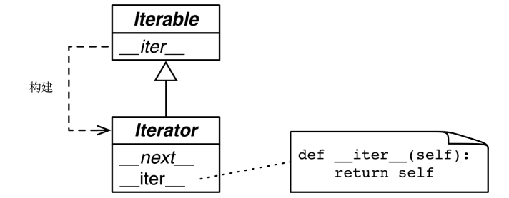

## 可迭代的对象、迭代器和生成器

####  1. 单词序列Sentence

```python
import re
import reprlib

RE_WORD = re.compile("\w+")


class Sentence:
    '''
    定义了一个 Sentence 类，通过索引从文本中提取单词。
    '''

    def __init__(self, text):
        self.text = text
        self.words = RE_WORD.findall(text)

    def __getitem__(self, item):
        return self.words[item]

    def __len__(self):
        return len(self.text)

    def __repr__(self):
        print(reprlib.repr(self.text))
        return f"{type(self).__name__}({self.text}):{self.words}"


sentence = Sentence('"The time has come," Tom said,')
print(sentence)
for i in sentence:
    print(i, end=' ')
print("\n" + sentence[0], sentence[-1])
```

---

#### 2. 序列可以迭代的原因：iter函数

解释器需要迭代对象 x 时，会自动调用 iter(x)。

内置的 iter 函数有以下作用：

1. 检查对象是否实现了 `__iter__` 方法，如果实现了就调用它，获取一个迭代器。
2. 如果没有实现 `__iter__` 方法，但是实现了 `__getitem__` 方法，Python 会创建一个迭代器，尝试按顺序（从索引 0 开始）获取元素。
3. 如果尝试失败，Python 抛出 TypeError 异常，通常会提示“C object is not iterable”（C对象不可迭代），其中 C 是目标对象所属的类。

任何 Python 序列都可迭代的原因是，它们都实现了 `__getitem__` 方法。其实，标准的序列也都实现了 `__iter__` 方法，因此也应该这么做。

检查一个对象是否可迭代：

```python
from collections import abc

print(iter(sentence))  # <iterator object at 0x000001E1A53E7AC8>
print(isinstance(sentence, abc.Iterable))  # False
s = 1
print(iter(s))  # TypeError: 'int' object is not iterable

obj = 123
try:
    print(iter(obj))
except Exception as e:
    print(e)
```

**检查对象 x 能否迭代，最准确的方法是：调用 `iter(x)` 函数，如果不可迭代，再处理TypeError 异常。**这比使用 `isinstance(x, abc.Iterable)` 更准确，因为 `iter(x)` 函数会考虑到遗留的 `__getitem__` 方法，而 `abc.Iterable` 类则不考虑。

---

#### 3. 可迭代的对象与迭代器的对比

可迭代的对象：
**使用 iter 内置函数可以获取迭代器的对象。**如果对象实现了能返回迭代器的 `__iter__`方法，那么对象就是可迭代的。**序列都可以迭代；另外，实现了 `__getitem__` 方法，而且其参数是从零开始的索引，这种对象也可以迭代**。

**可迭代的对象**和**迭代器**之间的关系：**Python 从可迭代的对象中获取迭代器**。

demo：

字符串 'abc' 是可迭代的对象。背后是有迭代器的，只不过我们看不到：

```python
s = "abc"
for i in s:
    print(i)
```

如果没有 for 语句，不得不使用 while 循环模拟：

```python
s_iter = iter(s)   # 使用可迭代的对象构建迭代器 s_iter。
while True:
    try:
        print(next(s_iter))
    except StopIteration:
        del s_iter  # 释放对s_iter的引用，即废弃迭代器对象。
        break
```

StopIteration 异常表明迭代器到头了。Python 语言内部会处理 for 循环和其他迭代上下文（如列表推导、元组拆包，等等）中的 StopIteration 异常。


标准的**迭代器接口**有两个方法:

- `__next__`
  返回下一个可用的元素，如果没有元素了，抛出 StopIteration 异常。

- `__iter__`
  返回 self，以便在应该使用可迭代对象的地方使用迭代器，例如在 for 循环中。

这个接口在 collections.abc.Iterator 抽象基类中制定。这个类定义了 `__next__` 抽象方法，而且继承自 Iterable 类；`__iter__` 抽象方法则在 Iterable 类中定义。

图解：Iterable 和 Iterator 抽象基类。以斜体显示的是抽象方法。具体的 `Iterable.__iter__` 方法应该返回一个 Iterator 实例。具体的 Iterator 类必须实现 `__next__` 方法。`Iterator.__iter__` 方法直接返回实例本身。

Iterator 抽象基类实现 `__iter__` 方法的方式是返回实例本身（`return  self`）。这样，在需要可迭代对象的地方可以使用迭代器。 abc.Iterator 类的源码：

```python
# from Lib._collections_abc import Iterator

class Iterable(metaclass=ABCMeta):

    __slots__ = ()

    @abstractmethod
    def __iter__(self):
        while False:
            yield None

    @classmethod
    def __subclasshook__(cls, C):
        if cls is Iterable:
            return _check_methods(C, "__iter__")
        return NotImplemented

      
class Iterator(Iterable):

    __slots__ = ()

    @abstractmethod
    def __next__(self):
        'Return the next item from the iterator. When exhausted, raise StopIteration'
        raise StopIteration

    def __iter__(self):
        return self

    @classmethod
    def __subclasshook__(cls, C):
        if cls is Iterator:
            return _check_methods(C, '__iter__', '__next__')
        return NotImplemented
```

检查对象 x 是否为迭代器最好的方式是调用 isinstance(x,  abc.Iterator)，相应的，检查是都是迭代对象用 isinstance(x, abc.Iterable)。

```python
from collections import abc
s = "abc"
print(isinstance(iter(s), abc.Iterator))  # True
```

**迭代器只需 `__next__` 和 `__iter__` 两个方法**，所以除了调用 `next()` 方法，以及捕获 `StopIteration`  异常之外，没有办法检查是否还有遗留的元素。此外，也没有办法“还原”迭代器。如果想再次迭代，那就要调用 iter(...)，传入之前构建迭代器的可迭代对象。传入迭代器本身没用，因为前面说过 `Iterator.__iter__` 方法的实现方式是返回实例本身，所以传入迭代器无法还原已经耗尽的迭代器。

```python
s1 = Sentence("I am zyp")
iter_s1 = iter(s1)  # 使用 iter(...)函数构建迭代器

print(isinstance(iter_s1, abc.Iterable))  # True
print(isinstance(iter_s1, abc.Iterator))  # True

print(next(iter_s1))  # I 使用 next(...) 函数使用迭代器
print(next(iter_s1))  # am
print(next(iter_s1))  # zyp
# print(next(iter_sentence))  # StopIteration
print(list(iter_s1))  # []

print(next(iter(s1)))  # I # 重新传入可迭代对象
print(list(iter(s1)))  # ['I', 'am', 'zyp']
```

**迭代器**
迭代器是这样的对象：实现了无参数的 `__next__` 方法，返回序列中的下一个元素；如果没有元素了，那么抛出 StopIteration 异常。**Python 中的迭代器还实现了 `__iter__` 方法，因此迭代器也可以迭代。**

---

#### 4. 典型的迭代器

```python
import re
import reprlib

RE_WORD = re.compile("\w+")


class SentenceIterator:
    def __init__(self, words):
        self.words = words
        self.index = 0

    def __next__(self):
        try:
            word = self.words[self.index]
        except IndexError as e:
            raise StopIteration
        self.index += 1
        return word

    def __iter__(self):
        return self


class Sentence:
    def __init__(self, text):
        self.text = text
        self.word = RE_WORD.findall(text)

    def __repr__(self):
        return f"{type(self).__name__}:{reprlib.repr(self.text)}"

    def __iter__(self):  # 明确表明这个类可以迭代
        # 根据可迭代协议，__iter__ 方法实例化并返回一个迭代器。
        return SentenceIterator(self.word)


# 在SentenceIterator中实现 __iter__ 可以让能让迭代器通过以下测试：
from collections import abc
print(issubclass(SentenceIterator, abc.Iterator))
```

可迭代的对象有个 `__iter__` 方法，每次都实例化一个新的迭代器；而迭代器要实现 `__next__` 方法，返回单个元素，此外还要实现 `__iter__` 方法，返回迭代器本身。因此，**迭代器可以迭代，但是可迭代的对象不是迭代器。**

除了 `__iter__` 方法之外，有人可能还想在Sentence类中实现 `__next__` 方法，让Sentence实例既是可迭代的对象，也是自身的迭代器。可是，这种想法非常糟糕的（原因不详述）。

**可迭代的对象一定不能是自身的迭代器。也就是说，可迭代的对象必须实现 `__iter__` 方法，但不能实现 `__next__` 方法。**

---

#### 5. 生成器函数

```python
import re
import reprlib

RE_WORD = re.compile("\w+")

class Sentence:
    def __init__(self, text):
        self.text = text
        self.word = RE_WORD.findall(text)

    def __repr__(self):
        return f"{type(self).__name__}:{reprlib.repr(self.text)}"

    def __iter__(self):    # 生成器函数
        for word in self.word:
            yield word
```

生成器函数的工作原理：

只要 Python 函数的定义体中有 **yield** 关键字，该函数就是生成器函数。调用生成器函数时，会返回一个生成器对象。也就是说，生成器函数是生成器工厂。

使用准确的词语描述从生成器中获取结果的过程，有助于理解生成器。注意，**产出**或**生成值**。如果说生成器“返回”值，就会让人难以理解。**函数返回值；调用生成器函数返回生成器；生成器产出或生成值**。生成器不会以常规的方式“返回”值：生成器函数定义体中的 return 语句会触发生成器对象抛出 StopIteration 异常。

使用 for 循环更清楚地说明了生成器函数定义体的执行过程：

```python
def gen_AB():
    print("start")
    yield "A"
    print("continue")
    yield "B"
    print("end")

for i in gen_AB():  # for机制会捕获异常
    print("--> ",i)
    
# start
# -->  A
# continue
# -->  B
# end
```

---

#### 6. Sentence类升级版：惰性实现

目前实现的几版 Sentence 类都不具有惰性，因为 `__init__`  方法急迫地构建好了文本中的单词列表，然后将其绑定到 self.words 属性上。这样就得处理整个文本，列表使用的内存量可能与文本本身一样多（或许更多，这取决于文本中有多少非单词字符）。如果只需迭代前几个单词，大多数工作都是白费力气。

re.finditer 函数是 re.findall 函数的惰性版本，返回的不是列表，而是一个生成器，按需生成 re.MatchObject 实例。如果有很多匹配，re.finditer 函数能节省大量内存。

```python
import re
import reprlib

RE_WORD = re.compile("\w+")

class Sentence:
    def __init__(self, text):
        self.text = text  # 不再需要words列表

    def __repr__(self):
        return f"{type(self).__name__}:{reprlib.repr(self.text)}"

    def __iter__(self):
        for match in RE_WORD.finditer(self.text):
            yield match.group()
```

---

#### 7. Sentence类终极版：生成器表达式

```python
import re
import reprlib

RE_WORD = re.compile("\w+")

class Sentence:
    def __init__(self, text):
        self.text = text

    def __repr__(self):
        return f"{type(self).__name__}:{reprlib.repr(self.text)}"

    def __iter__(self):
        return (match.group() for match in RE_WORD.finditer(self.text))
```

和前一个示例唯一的区别是 `__iter__` 方法，这里不是生成器函数了（没有 yield），而是使用**生成器表达式构建生成器**，然后将其返回。不过，最终的效果一样：调用 `__iter__`  方法会得到一个生成器对象。

生成器表达式是语法糖：完全可以替换成生成器函数，不过有时使用生成器表达式更便利。

遇到简单的情况时，可以使用**生成器表达式**；如果生成器表达式要分成多行写，倾向于定义生成器函数，以便提高可读性。此外，**生成器函数**有名称，因此可以重用。