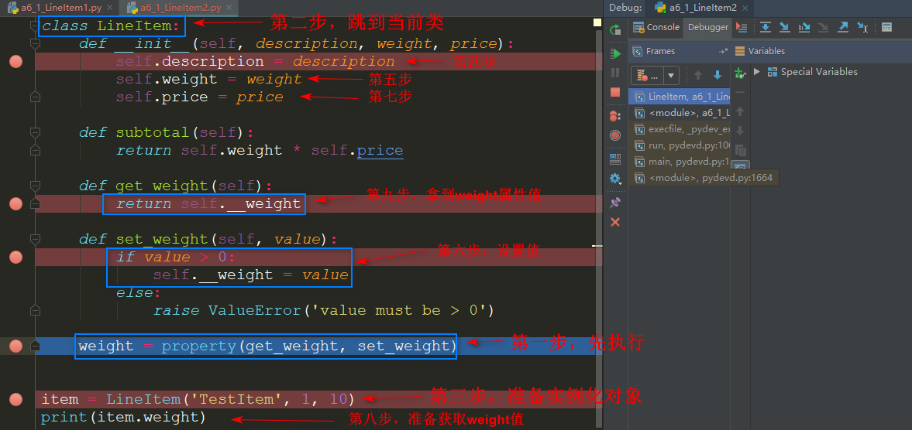
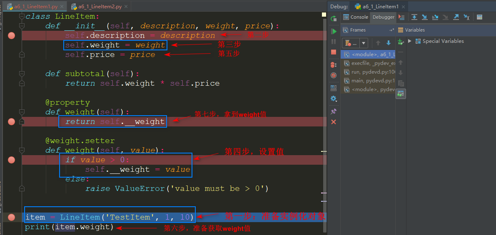

## 动态属性和特征

#### 1. 使用动态属性转换数据

```python
import os
import json
import warnings
from urllib.request import urlopen

URL = 'https://www.oreilly.com/pub/sc/osconfeed'
JSON_FILE = r'D:\keeplearning\myLearning\python\book2\osconfeed.json'

def load():
    if not os.path.exists(JSON_FILE):
        msg = f'downloading {URL} to {JSON_FILE}'
        warnings.warn(msg)
        with urlopen(URL) as remote, open(JSON_FILE, 'wb') as local:
            local.write(remote.read())
    # with open(JSON_FILE, mode='rb') as fp:
    with open(JSON_FILE, mode='r', encoding='utf8') as fp:
        print(json.load(fp))

if __name__ == '__main__':
    # load()
    feed = load2()
    print(sorted(feed['Schedule'].keys()))
    # ['conferences', 'events', 'speakers', 'venues']

    for key, value in sorted(feed['Schedule'].items()):
        print(f'{len(value)},{key}')
    # 1,conferences
    # 494,events
    # 357,speakers
    # 53,venues
```

在with语句中 **使用两个上下文管理器**（从Python 3.1起允许这么做），分别用于读取和保存远程文件。`json.load` 函数解析JSON文件，返回Python原生对象。在这个数据源中有这几种数据类型：dict、list、str和int。

---

#### 2. 使用动态属性访问JSON类数据

```python
from collections import abc

class FronzenJSON():
    '''
    一个只读接口，使用属性表示法访问JSON类对象
    '''
    def __init__(self, mapping):
        self.__data = dict(mapping)

    def __getattr__(self, name):
        if hasattr(self.__data, name):
            return getattr(self.__data, name)
        else:
            return FronzenJSON.build(self.__data[name])

    @classmethod
    def build(cls, obj):
        if isinstance(obj, abc.Mapping):
            return cls(obj)
        elif isinstance(obj, abc.MutableSequence):
            return [cls.build(item) for item in obj]
        else:
            return obj
```

使用mapping参数构建一个字典。这么做有两个目的：(1)确保传入的是字典（或者是能转换成字典的对象）；(2)安全起见，创建一个副本。仅当没有指定名称（name）的属性时才调用 `__getattr__` 方法，调用keys、items等方法就是通过这种方式处理的；build 函数中，如果obj是映射，那就构建一个FrozenJSON对象；如果是MutableSequence对象，必然是列表，因此，我们把obj中的每个元素递归地传给 .build() 方法，构建一个列表。

---

#### 3. 处理无效属性名

FrozenJSON类有个缺陷：没有对名称为Python关键字的属性做特殊处理。比如说像下面这样构建一个对象：` grad = FrozenJSON({'name': 'Jim Bo', 'class': 1982})`，此时无法读取 grad.class 的值，在pycharm中直接会提示此处代码有问题，因为在 Python 中 class 是保留字。

```python
grad = FrozenJSON({'name': 'Jim Bo', 'class': 1982})
print(getattr(grad, 'class'))
```

FrozenJSON类的目的是为了便于访问数据，因此更好的方法是检查传给 `FrozenJSON.__init__` 方法的映射中是否有键的名称为关键字，如果有，那么在键名后加上_，然后通过下述方式读取：

```python
import keyword
from collections import abc

class FrozenJSON():
    def __init__(self, mapping):
        self._data = {}
        for key, value in mapping.items():
            if keyword.iskeyword(key):  # 处理无效属性名
                key += '_'
            self._data[key] = value

    def __getattr__(self, name):
        if hasattr(self._data, name):
            print("hasattr:", name)
            return getattr(self._data, name)
        else:
            if keyword.iskeyword(name): # 这里也需要处理无效属性名
                name += '_'
            return FrozenJSON.build(self._data[name])

    @classmethod
    def build(cls, obj):
        if isinstance(obj, abc.Mapping):
            return cls(obj)
        elif isinstance(obj, abc.MutableSequence):
            return [cls.build(item) for item in obj]
        else:
            return obj
          
if __name__ == '__main__':
    grad = FrozenJSON({'name': 'Jim Bo', 'class': 1982})
    print(getattr(grad, 'class'))
    print(grad.class_)
```

---

#### 4. 使用__new__方法以灵活的方式创建对象

通常把 `__init__` 称为构造方法，这是从其他语言借鉴过来的术语。其实，用于构建实例的是特殊方法 `__new__` ：这是个类方法（使用特殊方式处理，因此不必使用@classmethod装饰器），必须返回一个实例。返回的实例会作为第一个参数（即self）传给 `__init__` 方法。因为调用 `__init__` 方法时要传入实例，而且禁止返回任何值，所以 `__init__` 方法其实是“初始化方法”。真正的构造方法是 `__new__`。我们几乎不需要自己编写 `__new__` 方法，因为从object类继承的实现已经足够了。

从 `__new__` 方法到 `__init__` 方法，是最常见的，但不是唯一的。`__new__` 方法也可以返回其他类的实例，此时，解释器不会调用 `__init__` 方法。

使用 `__new__` 方法取代build方法，构建可能是也可能不是FrozenJSON实例的新对象：

```python
import keyword
from collections import abc

class FrozenJSON():
    def __new__(cls, arg):
        if isinstance(arg, abc.Mapping):
            return super().__new__(cls)
        elif isinstance(arg, abc.MutableSequence):
            return [cls(item) for item in arg]
        else:
            return arg

    def __init__(self, mapping):
        self._data = {}
        for key, value in mapping.items():
            if keyword.iskeyword(key):
                key += '_'
            self._data[key] = value
            
    def __getattr__(self, name):
        if hasattr(self._data, name):
            return getattr(self._data, name)
        else:
            if keyword.iskeyword(name):
                name += '_'
            return FrozenJSON(self._data[name])

if __name__ == '__main__':
    grad = FrozenJSON({'name': 'Jim Bo', 'class': 1982})
    print(getattr(grad, 'class'))
    print(grad.class_)
```

` __new__ ` 是类方法，第一个参数是类本身，余下的参数与 `__init__`  方法一样，只不过没有 self。

`return super().__new__(cls)` 默认的行为是委托给超类的 `__new__` 方法，这里调用的是object基类的 `__new__` 方法，把唯一的参数设为FrozenJSON。`__new__` 方法中余下的代码与原先的build方法完全一样，之前，这里调用的是FrozenJSON.build方法，现在只需调用FrozenJSON构造方法。

`__new__` 方法的第一个参数是类，因为创建的对象通常是那个类的实例。所以，在`FrozenJSON.__new__` 方法中，`super（　）.__new__(cls)` 表达式会调用`object.__new__(FrozenJSON)`，而object类构建的实例其实是FrozenJSON实例，即那个实例的`__class__` 属性存储的是FrozenJSON类的引用。不过，真正的构建操作由解释器调用C语言实现的`object.__new__`方法执行。

---

#### 5. 使用特性验证属性：property

假设有个销售散装有机食物的电商应用，客户可以按重量订购坚果、干果或杂粮。在这个
系统中，每个订单中都有一系列商品，而每个商品都可以使用示例中的类表示：

```python
class LineItem:
    def __init__(self, description, weight, price):
        self.description = description
        self.weight = weight
        self.price = price

    def subtotal(self):
        return self.weight * self.price

    @property  
    def weight(self):
        return self.__weight

    @weight.setter
    def weight(self, value):
        if value > 0:
            self.__weight = value
        else:
            raise ValueError('value must be > 0')


item = LineItem('TestItem', 1, 10)
print(item.weight)
```

@property 装饰读值方法，此时的 weight 函数将真正的值存储在私有属性 __weight 中，被装饰的读值方法有个 .setter 属性，这个属性也是装饰器，这个装饰器把读值方法和设值方法绑定在一起。

---

虽然内置的 property 经常用作装饰器，但它其实是一个类。**在 Python 中，函数和类通常可以互换，因为二者都是可调用的对象，而且没有实例化对象的 new 运算符，所以调用构造方法与调用工厂函数没有区别**。此外，只要能返回新的可调用对象，代替被装饰的函数，二者都可以用作装饰器。

property 构造方法的完整签名：`property(fget=None, fset=None, fdel=None, doc=None)`
所有参数都是可选的，如果没有把函数传给某个参数，那么得到的特性对象就不允许执行相应的操作。

曾经没有 @ 装饰器句法，不使用装饰器定义特性的“经典”句法如示例：

```python
class LineItem:
    def __init__(self, description, weight, price):
        self.description = description
        self.weight = weight
        self.price = price

    def subtotal(self):
        return self.weight * self.price

    def get_weight(self):
        return self.__weight

    def set_weight(self, value):
        if value > 0:
            self.__weight = value
        else:
            raise ValueError('value must be > 0')

    weight = property(get_weight, set_weight)

item = LineItem('TestItem', 1, 10)
print(item.weight)
```

`weight = property(get_weight, set_weight)` 通过构建 property 对象，然后赋值给公开的类属性。

通过加断点debug，看出两种方法的执行过程是不同的：

1. 使用 property(get_weight, set_weight)：



2. 使用 @property：



---

#### 6. 特性会覆盖属性

特性都是类属性，但是特性管理的其实是实例属性的存取。

实例属性掩盖类的数据属性：

```python
class Class:
    data = 'class data attr'
    @property
    def prop(self):
        return 'prop func'
    
obj = Class()
vars(obj)    # vars 函数返回 obj 的 __dict__ 属性，表明没有实例属性。
Out[4]: {}
obj.data
Out[5]: 'class data attr'
obj.data = 'new data attr'
vars(obj)
Out[7]: {'data': 'new data attr'}
obj.data
Out[8]: 'new data attr'
Class.data
Out[9]: 'class data attr'
```

尝试覆盖 obj 实例的 prop 特性：

```python
Class.prop
Out[10]: <property at 0x27ba3839cc8>
obj.prop
Out[11]: 'prop func'
obj.prop = 'new prop func'  # 设置实例属性 prop ，结果失败
Traceback (most recent call last):
  ......
    obj.prop = 'new prop func'
AttributeError: can't set attribute
obj.__dict__['prop'] = 'nnew'
vars(obj)
Out[14]: {'data': 'new data attr', 'prop': 'nnew'}
obj.prop
Out[15]: 'prop func'
Class.prop = 'class prop'
obj.prop
Out[17]: 'nnew'
Class.prop
Out[18]: 'class prop'
```

为 Class 类新添一个特性，覆盖实例属性:

```python
obj.data
Out[19]: 'new data attr'
Class.data
Out[20]: 'class data attr'
Class.data = property(lambda self: 'the "data" prop value')
obj.data
Out[22]: 'the "data" prop value'
del Class.data
obj.data
Out[24]: 'new data attr'
```

**obj.attr 这样的表达式不会从 obj 开始寻找 attr，而是从 `obj.__class__` 开始，而且，仅当类中没有名为 attr 的特性时，Python 才会在 obj 实例中寻找。**

---

#### 7. 定义一个特性工厂函数

```python
# 工厂函数
def quantity(storage_name):
    def qty_getter(instance):
        # 值直接从 instance.__dict__ 中获取，为的是跳过特性，防止无限递归。
        return instance.__dict__[storage_name]

    def qty_setter(instance, value):
        if value > 0:
            instance.__dict__[storage_name] = value  # 也是为了跳过特性
        else:
            raise ValueError('value must be > 0')

    return property(qty_getter, qty_setter)

  
class LineItem:
    weight = quantity('weight')
    price = quantity('price')

    def __init__(self, description, weight, price):
        self.description = description
        self.weight = weight
        self.price = price

    def subtotal(self):
        return self.weight * self.price

      
if __name__ == '__main__':
    item = LineItem("Test Item", 8, 18)
    print(item.weight, item.price)
    print(sorted(vars(item).items()))
```

在工厂函数的最后一行，使用 property 对象包装 qty_getter 和 qty_setter 函数。需要运行这两个函数时，它们会从闭包中读取 storage_name，确定从哪里获取属性的值，或者在哪里存储属性的值。

工厂函数构建的特性利用了前面所述的行为：weight 特性覆盖了 weight 实例属性，因此对 self.weight 或 item.weight 的每个引用都由特性函数处理，只有直接存取 `__dict__` 属性才能跳过特性的处理逻辑。

---

#### 8. 影响属性处理方式的特殊属性

`__class__` 

对象所属类的引用（即 `obj.__class__` 与 `type(obj)` 的作用相同）。Python的某些特殊方法，例如`__getattr__`，只在对象的类中寻找，而不在实例中寻找。

`__dict__`

一个映射，存储对象或类的可写属性。有 `__dict__` 属性的对象，任何时候都能随意设置新属性。如果类有 `__slots__` 属性，它的实例可能没有 `__dict__` 属性。参见下面对`__slots__` 属性的说明。

`__slots__` 

类可以定义这个这属性，限制实例能有哪些属性。`__slots__` 属性的值是一个字符串组成的元组，指明允许有的属性。如果 `__slots__` 中没有 '`__dict__`'，那么该类的实例没有 `__dict__` 属性，实例只允许有指定名称的属性。

---

#### 9. 处理属性的内置函数

`dir([object])`

列出对象的大多数属性。官方文档说，dir函数的目的是交互式使用，因此没有提供完整的属性列表，只列出一组“重要的”属性名。dir函数能审查有或没有 `__dict__` 属性的对象。dir函数不会列出`__dict__` 属性本身，但会列出其中的键。dir函数也不会列出类的几个特殊属性，例如 `__mro__`、`__bases__` 和 `__name__`。如果没有指定可选的object参数，dir函数会列出当前作用域中的名称。

`getattr(object, name[, default])`

从object对象中获取 name 字符串对应的属性。获取的属性可能来自对象所属的类或超类。如果没有指定的属性，getattr函数抛出AttributeError异常，或者返回default参数的值（如果设定了这个参数的话）。

`hasattr(object, name)`

如果object对象中存在指定的属性，或者能以某种方式（例如继承）通过object对象获取指定的属性，返回True。文档说道：“这个函数的实现方法是调用getattr(object, name)函数，看看是否抛出AttributeError异常。”

`setattr(object, name, value)`

把object对象指定属性的值设为value，前提是object对象能接受那个值。这个函数可能会创建一个新属性，或者覆盖现有的属性。

`vars([object])`

返回object对象的 `__dict__` 属性；如果实例所属的类定义了 `__slots__` 属性，实例没有 `__dict__` 属性，那么vars函数不能处理那个实例（相反，dir函数能处理这样的实例）。如果没有指定参数，那么 vars() 函数的作用与 locals() 函数一样：返回表示本地作用域的字典。

---

#### 10. 处理属性的特殊方法

使用点号或内置的getattr、hasattr和setattr函数存取属性都会触发下述列表中相应的特殊方法。但是，直接通过实例的__dict__属性读写属性不会触发这些特殊方法——如果需要，通常会使用这种方式跳过特殊方法。

假设有个名为Class的类，obj是Class类的实例，attr是obj的属性。

`__delattr__(self, name)` 

只要使用del语句删除属性，就会调用这个方法。例如，`del obj.attr` 语句触发 `Class.__delattr__(obj, 'attr')` 方法。

`__dir__(self)` 

把对象传给dir函数时调用，列出属性。例如，`dir(obj)` 触发 `Class.__dir__(obj)` 方法。

`__getattr__(self, name)` 

仅当获取指定的属性失败，搜索过obj、Class和超类之后调用。表达式 `obj.no_such_attr`、`getattr(obj, 'no_such_attr')` 和 `hasattr(obj, 'no_such_attr')` 可能会触发`Class.__getattr__(obj,'no_such_attr')` 方法，但是，仅当在obj、Class和超类中找不到指定的属性时才会触发。

`__getattribute__(self, name)` 

尝试获取指定的属性时总会调用这个方法，不过，寻找的属性是特殊属性或特殊方法时除外。点号与 getattr 和 hasattr 内置函数会触发这个方法。调用 `__getattribute__` 方法且抛出AttributeError异常时，才会调用 `__getattr__` 方法。**为了在获取obj实例的属性时不导致无限递归，`__getattribute__` 方法的实现要使用 `super().__getattribute__(obj, name)` 。**

`__setattr__(self, name, value)`

尝试设置指定的属性时总会调用这个方法。点号和setattr内置函数会触发这个方法。例如，`obj.attr=42` 和 `setattr(obj, 'attr', 42)` 都会触发 `Class.__setattr__(obj, ‘attr’, 42)` 方法。