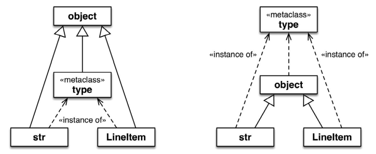
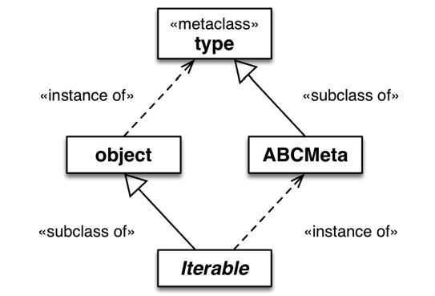

#### 1. 模块导入时和运行时比较

Python程序员会区分“导入时”和“运行时”，不过这两个术语没有严格的定义，而且二者之间存在着灰色地带。

在导入时，解释器会从上到下一次性解析完.py模块的源码，然后生成用于执行的字节码。如果句法有错误，就在此时报告。

如果本地的 `__pycache__` 文件夹中有最新的 .pyc 文件，解释器会跳过上述步骤，因为已经有运行所需的字节码了。

---

编译肯定是导入时的活动，不过那个时期还会做些其他事，因为Python中的语句几乎都是可执行的，也就是说语句可能会运行用户代码，修改用户程序的状态。

尤其是import语句，它不只是声明，在进程中首次导入模块时，还会运行所导入模块中的全部顶层代码——以后导入相同的模块则使用缓存，只做名称绑定。那些顶层代码可以做任何事，包括通常在“运行时”做的事，例如连接数据库。

因此，“导入时”与“运行时”之间的界线是模糊的：import语句可以触发任何“运行时”行为。

---

导入时会“运行全部顶层代码”，但是“顶层代码”会经过一些加工。导入模块时，解释器会执行顶层的def语句，可是这么做有什么作用呢？

解释器会编译函数的定义体（首次导入模块时），把函数对象绑定到对应的全局名称上，但是显然解释器不会执行函数的定义体。通常这意味着解释器在导入时定义顶层函数，但是仅当在运行时调用函数时才会执行函数的定义体。

对类来说，情况就不同了：在导入时，解释器会执行每个类的定义体，甚至会执行嵌套类的定义体。执行类定义体的结果是，定义了类的属性和方法，并构建了类对象。从这个意义上理解，类的定义体属于“顶层代码”，因为它在导入时运行。

---

#### 2.理解计算时间的练习

```python
# evalsupport.py
print('<[100]> evalsupport module start')


def deco_alpha(cls):
    print('<[200]> deco_alpha')

    def inner_1(self):
        print('<[300]> deco_alpha:inner_1')

    cls.method_y = inner_1
    return cls


class MetaAleph(type):
    print('<[400]> MetaAleph body')

    def __init__(cls, name, bases, dic):
        print('<[500]> MetaAleph.__init__')

        def inner_2(self):
            print('<[600]> MetaAleph.__init__:inner_2')

        cls.method_z = inner_2


print('<[700]> evalsupport module end')
```

```python
# evaltime.py
from evalsupport import deco_alpha

print('<[1]> evaltime module start')


class ClassOne():
    print('<[2]> ClassOne body')

    def __init__(self):
        print('<[3]> ClassOne.__init__')

    def __del__(self):
        print('<[4]> ClassOne.__del__')

    def method_x(self):
        print('<[5]> ClassOne.method_x')

    class ClassTwo(object):
        print('<[6]> ClassTwo body')

# 先计算被装饰的类ClassThree的定义体，然后运行装饰器函数。
@deco_alpha
class ClassThree():
    print('<[7]> ClassThree body')

    def method_y(self):
        print('<[8]> ClassThree.method_y')


class ClassFour(ClassThree):
    print('<[9]> ClassFour body')

    def method_y(self):
        print('<[10]> ClassFour.method_y')


if __name__ == '__main__':
    print('<[11]> ClassOne tests', 30 * '.')
    one = ClassOne()
    one.method_x()
    print('<[12]> ClassThree tests', 30 * '.')
    three = ClassThree()
    three.method_y()
    print('<[13]> ClassFour tests', 30 * '.')
    four = ClassFour()
    four.method_y()

print('<[14]> evaltime module end')
```

---

场景1结果：evaltime.py 被当做模块导入到其他模块中

```python
<[100]> evalsupport module start
<[400]> MetaAleph body
<[700]> evalsupport module end
<[1]> evaltime module start
<[2]> ClassOne body
<[6]> ClassTwo body
<[7]> ClassThree body
<[200]> deco_alpha
<[9]> ClassFour body
<[14]> evaltime module end
```

导入evaltime模块时，其中的 evalsupport 模块中的所有顶层代码在导入模块时运行；解释器会编译 deco_alpha 函数，但是不会执行定义体；ClassThree 被装饰器 deco_alpha 修饰，先计算被装饰的类 ClassThree 的定义体，然后运行装饰器函数deco_alpha ；evaltime模块是导入的，因此不会运行 `if __name__=='__main__':` 块。

小结：

- 这个场景由简单的 import evaltime 语句触发；
- 解释器会执行所导入模块及其依赖（evalsupport）中的每个类定义体；
- 解释器先计算类的定义体，然后调用依附在类上的装饰器函数，这是合理的行为，因为必须先构建类对象，装饰器才有类对象可处理；
- 在这个场景中，只运行了一个用户定义的函数或方法——deco_alpha装饰器。

----

场景2结果：运行evaltime.py

```python
<[100]> evalsupport module start
<[400]> MetaAleph body
<[700]> evalsupport module end
<[1]> evaltime module start
<[2]> ClassOne body
<[6]> ClassTwo body
<[7]> ClassThree body
<[200]> deco_alpha
<[9]> ClassFour body
<[11]> ClassOne tests ..............................
<[3]> ClassOne.__init__
<[5]> ClassOne.method_x
<[12]> ClassThree tests ..............................
<[300]> deco_alpha:inner_1
<[13]> ClassFour tests ..............................
<[10]> ClassFour.method_y
<[14]> evaltime module end
<[4]> ClassOne.__del__
```

deco_alpha 装饰器修改了 `ClassThree.method_y` 方法，因此调用 `three.method_y()`时会运行 inner_1 函数的定义体。只有程序结束时，绑定在全局变量 one 上的 ClassOne 实例才会被垃圾回收程序回收。

场景2主要想说明的是，类装饰器可能对子类没有影响。在示例中，把 ClassFour 定义为 ClassThree 的子类，ClassThree 类上依附的 @deco_alpha 装饰器把 method_y 方法替换掉了，但是这对 ClassFour 类根本没有影响。当然，如果 `ClassFour.method_y` 方法使用 `super(...)` 调用 `ClassThree.method_y` 方法，我们便会看到装饰器起作用，执行inner_1函数。

```python
class ClassFour(ClassThree):
    print('<[9]> ClassFour body')

    def method_y(self):
        print('<[10]> ClassFour.method_y')
        super(ClassFour, self).method_y()
```

```python
<[13]> ClassFour tests ..............................
<[10]> ClassFour.method_y
<[300]> deco_alpha:inner_1  # 装饰器起作用了
```

---

#### 3. 元类基础知识

元类是制造类的工厂，不过不是函数，而是类。

根据Python对象模型，类是对象，因此类肯定是另外某个类的实例。默认情况下，**Python中的类是type类的实例**。也就是说，**type是大多数内置的类和用户定义的类的元类**：

```python
>>> 'spam'.__class__ 
<class 'str'> 
>>> str.__class__ 
<class 'type'> 

>>> LineItem.__class__
<class 'type'> 
>>> type.__class__ 
<class 'type'>

>>> object.__class__
<class 'type'>
```

为了避免无限回溯，type是其自身的实例。

没有说 str 或 LineItem 继承自type。而是说，str和LineItem是type的实例。这两个类是object的子类。



两个示意图都是正确的。左边的示意图强调 **str、type和LineItem是object的子类**。右边的示意图则清楚地表明**str、object和LineItem是type的实例**，因为它们都是类

object类和type类之间的关系很独特：object是type的实例，而type是object的子类。这种关系很“神奇”，无法使用Python代码表述，因为定义其中一个之前另一个必须存在。type是自身的实例这一点也很神奇。

除了type，标准库中还有一些别的元类，例如ABCMeta和Enum。如下述代码片段所示，collections.Iterable所属的类是abc.ABCMeta。Iterable是抽象类，而ABCMeta不是——不管怎样，Iterable是ABCMeta的实例：

```python
>>> import collections 
>>> collections.Iterable.__class__ 
<class 'abc.ABCMeta'> 

>>> import abc 
>>> abc.ABCMeta.__class__ 
<class 'type'> 
>>> abc.ABCMeta.__mro__ 
(<class 'abc.ABCMeta'>, <class 'type'>, <class 'object'>)
```

向上追溯，ABCMeta最终所属的类也是type。所有类都直接或间接地是type的实例，不过只有元类同时也是type的子类。若想理解元类，一定要知道这种关系：元类（如ABCMeta）从type类继承了构建类的能力。



所有类都是type的实例，但是元类还是type的子类，因此可以作为制造类的工厂。

---

#### 4.理解元类计算时间的练习

```python
# evaltime_meta.py
from evalsupport import deco_alpha
from evalsupport import MetaAleph

print('<[1]> evaltime_meta module start')


@deco_alpha
class ClassThree():
    print('<[2]> ClassThree body')

    def method_y(self):
        print('<[3]> ClassThree.method_y')


class ClassFour(ClassThree):
    print('<[4]> ClassFour body')

    def method_y(self):
        print('<[5]> ClassFour.method_y')


# ClassFive 是 MetaAleph 元类的实例
class ClassFive(metaclass=MetaAleph):
    print('<[6]> ClassFive body')

    def __init__(self):
        print('<[7]> ClassFive.__init__')

    def method_z(self):
        print('<[8]> ClassFive.method_z')


class ClassSix(ClassFive):
    print('<[9]> ClassSix body')

    def method_z(self):
        print('<[10]> ClassSix.method_z')


if __name__ == '__main__':
    print('<[11]> ClassThree tests', 30 * '.')
    three = ClassThree()
    three.method_y()
    print('<[12]> ClassFour tests', 30 * '.')
    four = ClassFour()
    four.method_y()
    print('<[13]> ClassFive tests', 30 * '.')
    five = ClassFive()
    five.method_z()
    print('<[14]> ClassSix tests', 30 * '.')
    six = ClassSix()
    six.method_z()

print('<[15]> evaltime_meta module end')
```

----

场景3：evaltime_meta.py 被当做模块导入：

```python
<[100]> evalsupport module start
<[400]> MetaAleph body
<[700]> evalsupport module end
<[1]> evaltime_meta module start
<[2]> ClassThree body
<[200]> deco_alpha
<[4]> ClassFour body
<[6]> ClassFive body
<[500]> MetaAleph.__init__  # 与场景1的关键区别是，创建ClassFive时调用了MetaAleph.__init__方法。
<[9]> ClassSix body
<[500]> MetaAleph.__init__  # 创建ClassFive的子类ClassSix时也调用了MetaAleph.__init__方法。
<[15]> evaltime_meta module end
```

`from evalsupport import deco_alpha`在导入 deco_alpha 时，会执行 evalsupport 的所有顶层代码，所以有了上面结果的前3个打印输出。

编写元类时，通常会把self参数改成cls。例如，在上述元类的 `__init__` 方法中，把第一个参数命名为cls能清楚地表明要构建的实例是类。`__init__`方法的定义体中定义了inner_2函数，然后将其绑定给`cls.method_z`。`MetaAleph.__init__` 方法签名中的cls指代要创建的类（例如ClassFive）。而inner_2函数签名中的self最终是指代我们在创建的类的实例（例如ClassFive类的实例）。

---

场景4：执行evaltime_meta.py：

```python
<[100]> evalsupport module start
<[400]> MetaAleph body
<[700]> evalsupport module end
<[1]> evaltime_meta module start
<[2]> ClassThree body  # class ClassThree():有被装饰器 deco_alpha 修饰，执行完类后会执行装饰器函数。
<[200]> deco_alpha
<[4]> ClassFour body   # class ClassFour(ClassThree): 执行时，虽然继承了被装饰的ClassThree，但是ClassFour不会继承装饰器函数，因此不会ClassFour执行后，不会执行装饰器函数。
<[6]> ClassFive body   # class ClassFive(metaclass=MetaAleph):执行后，需要执行元类的init函数，完成实例化。
<[500]> MetaAleph.__init__
<[9]> ClassSix body    # class ClassSix(ClassFive):继承ClassFive，所以会继承元类，执行完ClassSix后执行元类。
<[500]> MetaAleph.__init__
<[11]> ClassThree tests ..............................
<[300]> deco_alpha:inner_1   # ClassThree被装饰器修饰而更改了method_y函数。
<[12]> ClassFour tests ..............................
<[5]> ClassFour.method_y   # 虽ClassFour是ClassThree的子类，但是没有像ClassThree依附装饰器而更改了method_y函数。
<[13]> ClassFive tests ..............................
<[7]> ClassFive.__init__
<[600]> MetaAleph.__init__:inner_2  # ClassFive是MetaAleph元类的实例，在MetaAleph的init函数中把method_z绑定为inner_2
<[14]> ClassSix tests ..............................
<[7]> ClassFive.__init__     # ClassSix继承了ClassFive，所以six=ClassSix()实例化会执行ClassFive的init函数
<[600]> MetaAleph.__init__:inner_2  # 同理，作为父类的ClassFive是MetaAleph元类的实例，所以ClassSix也是。
<[15]> evaltime_meta module end
```

注意，ClassSix类没有直接引用MetaAleph类，但是却受到了影响，因为它是ClassFive的子类，进而也是MetaAleph类的实例，所以由`MetaAleph.__init__` 方法初始化。

---

