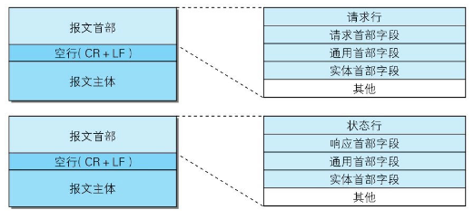
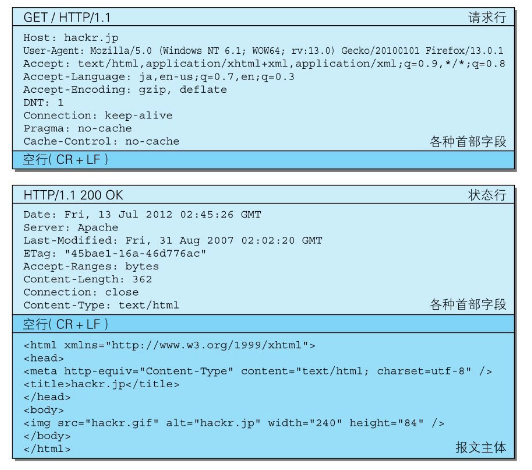
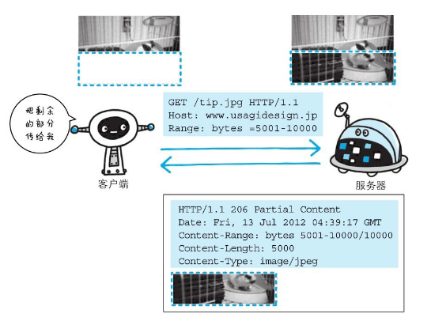

[toc]

## HTTP报文

用于HTTP协议交互的信息被称为HTTP报文。请求端（客户端）的HTTP报文叫做请求报文，响应端（服务器端）的叫做响应报文。HTTP报文本身是由多行（用CR+LF作换行符）数据构成的字符串文本。

HTTP报文大致可分为**报文首部**和**报文主体**两块。两者由最初出现的空行（CR+LF）来划分。通常，**并不一定要有报文主体。**

---

## 请求报文、响应报文的结构

请求报文和响应报文的结构：



请求报文和响应报文的实例：



**请求行**：包含用于请求的方法，请求URI和HTTP版本。

**状态行**：包含表明响应结果的状态码，原因短语和HTTP版本。

**首部字段**：包含表示请求和响应的各种条件和属性的各类首部。一般有4种首部，分别是：通用首部、请求首部、响应首部和实体首部。

**其他**：可能包含HTTP的RFC里未定义的首部（Cookie等）。

---

## 编码提升传输效率

HTTP在传输数据时可以按照数据原貌直接传输，但也可以在传输过程中通过编码提升传输速率。**传输时编码，能有效地处理大量访问请求，但该操作需要消耗更多的CPU等资源。**

### 报文主体和实体主体的差异

- 报文（message）：是HTTP通信中的基本单位，由8位组字节流（octet sequence，其中octet为8个比特）组成，通过HTTP通信传输。

- 实体（entity）：作为请求或响应的有效载荷数据（补充项）被传输，其内容由**实体首部**和**实体主体**组成。

**HTTP报文的主体用于传输请求或响应的实体主体。**

通常，报文主体等于实体主体。只有当传输中进行编码操作时，实体主体的内容发生变化，才导致它和报文主体产生差异。

### 压缩传输的内容编码

内容编码：在实体内容上编码，并保持实体信息原样压缩。内容编码后的实体由客户端接收并负责解码。

常用的内容编码有以下几种：

- gzip（GNU zip）
- compress（UNIX系统的标准压缩）
- deflate（zlib）
- identity（不进行编码）

### 分割发送的分块传输编码

在HTTP通信过程中，请求的编码实体资源尚未全部传输完成之前，浏览器无法显示请求页面。在传输大容量数据时，通过把数据分割成多块，能够让浏览器逐步显示页面。这种把实体主体分块的功能称为**分块传输编码**（Chunked Transfer Coding）。

使用分块传输编码的实体主体会由接收的客户端负责解码，恢复到编码前的实体主体。

---

## 发送多种数据的多部分对象集合

发送邮件时，可以在邮件里写入文字并添加多份附件。这是因为采用了MIME（Multipurpose Internet Mail Extensions，多用途因特网邮件扩展）机制，它允许邮件处理文本、图片、视频等多个不同类型的数据。在MIME扩展中会使用一种称为**多部分对象集合**（Multipart）的方法，来容纳多份不同类型的数据。

HTTP协议中也采纳了多部分对象集合，发送的一份报文主体内可含有多类型实体。通常是在图片或文本文件等上传时使用。报文中使用多部分对象集合时，需要在首部字段里加上Content-type。

多部分对象集合包含的对象如下：

- multipart/form-data 在Web表单文件上传时使用。
- multipart/byteranges 状态码206（Partial Content，部分内容）响应报文包含了多个范围的内容时使用。

---

## 获取部分内容的范围请求

为了解决 “下载过程中遇到网络中断的情况，那就必须重头开始” 的问题，需要一种可恢复的机制。所谓恢复是指能从之前下载中断处恢复下载。

要实现该功能需要指定下载的实体范围，指定范围发送的请求叫做**范围请求**（Range Request）。

举例：对一份10000字节大小的资源，如果使用范围请求，可以只请求5001～10000字节内的资源。



执行范围请求时，会用到首部字段Range来指定资源的byte范围，响应会返回状态码为206 Partial Content的响应报文；对于多重范围的范围请求，响应会在首部字段Content-Type标明 multipart/byteranges 后返回响应报文。byte范围的指定形式如下：

5001～10000字节：

```
Range:bytes=5001-10000
```

从5001字节之后全部的：

```
Range:bytes=5001-
```

从一开始到3000字节和5000～7000字节的多重范围:

```
Range:bytes=-3000, 5000-7000
```

如果服务器端无法响应范围请求，则会返回状态码200 OK和完整的实体内容。

---

## 内容协商

同一个Web网站有可能存在着多份相同内容的页面。比如英语版和中文版的Web页面，内容虽相同，但语言却不同。

当浏览器的默认语言为英语或中文，访问相同URI的Web页面时，则会显示对应的英语版或中文版的Web页面。这样的机制称为**内容协商**（ContentNegotiation）。

内容协商机制：客户端和服务器端就响应的资源内容进行交涉，然后提供**给客户端最为适合的资源**。内容协商会以响应资源的语言(Accept)、字符集(Accept-Charset)、编码方式(Accept-Encoding)、语言(Accept-Language、Content-Language)等作为判断的基准。

内容协商的类型：

- 服务器驱动协商（Server-driven Negotiation）：由服务器端进行内容协商。以请求的首部字段为参考，在服务器端自动处理。但对用户来说，以浏览器发送的信息作为判定的依据，并不一定能筛选出最优内容。
- 客户端驱动协商（Agent-driven Negotiation）：由客户端进行内容协商的方式。用户从浏览器显示的可选项列表中手动选择。还可以利用JavaScript脚本在Web页面上自动进行上述选择。比如按OS的类型或浏览器类型，自行切换成PC版页面或手机版页面。
- 透明协商（Transparent Negotiation）：服务器驱动和客户端驱动的结合体，是由服务器端和客户端各自进行内容协商的一种方法。