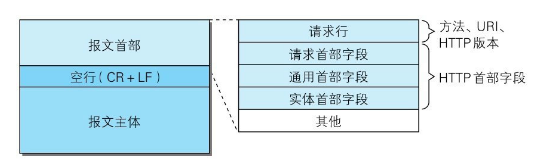
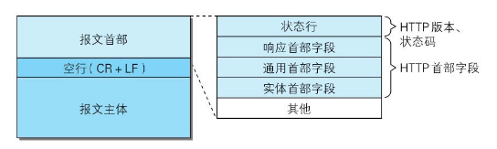
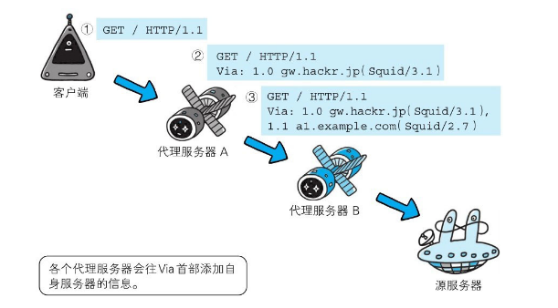

[toc]

## HTTP 报文首部

HTTP 报文的结构：

| 报文首部      | 在客户端和服务器处理时，起关键作用的信息几乎都在这边 |
| ------------- | ---------------------------------------------------- |
| 空行（CR+LF） |                                                      |
| **报文主体**  | 所需要的用户和资源的信息都在这边                     |

**HTTP协议的请求和响应报文中必定包含HTTP首部**。首部内容为客户端和服务器分别处理请求和响应提供所需要的信息。对于客户端用户来说，这些信息中的大部分内容都无须亲自查看。

请求报文由方法、URI、HTTP版本、HTTP首部字段等部分构成。



响应报文由HTTP版本、状态码（数字和原因短语）、HTTP首部字段3部分构成。



在报文众多的字段当中，HTTP首部字段包含的信息最为丰富。首部字段同时存在于请求和响应报文内，并涵盖HTTP报文相关的内容信息。

---

## HTTP 首部字段

使用首部字段是为了给浏览器和服务器提供报文主体大小、所使用的语言、认证信息等内容。

HTTP首部字段组成：

```
首部字段名:字段值
```

例如：

```
Content-Type: text/html
```

另外，字段值对应单个HTTP首部字段可以有多个值，例如：

```
Keep-Alive:timeout=15, max=100
```

### 4种HTTP首部字段类型

1. **通用**首部字段（General Header Fields）

   请求、响应报文双方都会使用的首部。

2. **请求**首部字段（Request Header Fields）

   客户端向服务器发送请求使用的首部。补充了请求的附加内容、客户端信息、响应内容相关优先级等。

3. **响应**首部字段（Response Header Fields）

   服务器给客户端返回响应报文使用的首部。补充了响应的附加内容，要求客户端附加额外的内容信息。

4. **实体**首部字段（Entity Header Fields）

   请求、响应报文的实体部分使用的首部。补充了资源内容更新时间等于实体有关的信息。

### HTTP/1.1 首部字段

通用首部字段：

| 首部字段名        | 说明                       |
| ----------------- | -------------------------- |
| Cache-Control     | 控制缓存的行为             |
| Connection        | 逐跳首部、连接的管理       |
| Data              | 创建报文的日期时间         |
| Pragma            | 报文指令                   |
| Trailer           | 报文末端的首部一览         |
| Transfer-Encoding | 指定报文主体的传输编码方式 |
| Upgrade           | 升级为其他协议             |
| Via               | 代理服务器的相关信息       |
| Warning           | 错误信息                   |

请求首部字段：

| 首部字段名          | 说明                                          |
| ------------------- | --------------------------------------------- |
| Accept              | 用户代理可处理的媒体类型                      |
| Accept-Charset      | 优先的字符集                                  |
| Accept-Encoding     | 优先的内容编码                                |
| Accept-Language     | 优先的语言（自然语言）                        |
| Authorization       | Web认证信息                                   |
| Expect              | 期待服务器的特定行为                          |
| From                | 用户的电子邮箱地址                            |
| Host                | 请求资源所在的服务器                          |
| If-Match            | 比较实体标记（ETag）                          |
| If-Modified-Since   | 比较资源的更新时间                            |
| If-None-Match       | 比较实体标记（与If-Match相反）                |
| If-Range            | 资源未更新时发送实体Byte的范围请求            |
| If-Unmodified-Since | 比较资源的更新时间（与If-Modified-Since相反） |
| Max-Forwards        | 最大传输逐跳数                                |
| Proxy-Authorization | 代理服务器要求客户端的认证信息                |
| Range               | 实体的字节范围请求                            |
| Referer             | 对请求中URI的原始获取方                       |
| TE                  | 传输编码的优先级                              |
| User-Agent          | HTTP客户端程序的信息                          |

响应首部字段：

| 首部字段名         | 说明                         |
| ------------------ | ---------------------------- |
| Accept-Ranges      | 是否接受字节范围请求         |
| Age                | 推算资源创建经过时间         |
| ETag               | 资源的匹配信息               |
| Location           | 令客户端重定向至指定URI      |
| Proxy-Authenticate | 代理服务器对客户端的认证信息 |
| Retry-After        | 对再次发起请求的时机要求     |
| Server             | HTTP服务器的安装信息         |
| Vary               | 代理服务器缓存的管理信息     |
| WWW-Authenticate   | 服务器对客户端的认证信息     |

实体首部字段：

| 首部字段名       | 说明                         |
| ---------------- | ---------------------------- |
| Allow            | 资源可支持的HTTP方法         |
| Content-Encoding | 实体主体适用的编码方式       |
| Content-Language | 实体适用的自然语言           |
| Content-Length   | 实体主体的大小（单位：字节） |
| Content-Location | 代替对应资源的URI            |
| Content-MD5      | 实体主体的报文摘要           |
| Content-Range    | 实体主体的位置范围           |
| Content-Type     | 实体主体的媒体类型           |
| Expires          | 实体主体过期的日期时间       |
| Last-Modified    | 资源的最后修改日期           |

### 非HTTP/1.1首部字段

在HTTP协议通信交互中使用到的首部字段，不限于RFC2616中定义的47种首部字段。还有**Cookie**、**Set-Cookie**和**Content-Disposition**等在其他RFC中定义的首部字段，它们的使用频率也很高。

### 端到端首部、逐跳首部

HTTP首部字段将定义成**缓存代理**和**非缓存代理**的行为，分成2种类型。

端到端首部（End-to-end Header）：

分在此类别中的首部会转发给请求/响应对应的最终接收目标，且必须保存在由缓存生成的响应中，另外规定它必须被转发。

逐跳首部（Hop-by-hop Header）：

分在此类别中的首部只对单次转发有效，会因通过缓存或代理而不再转发。HTTP/1.1和之后版本中，如果要使用hop-by-hop首部，需提供Connection首部字段。

下面列举了HTTP/1.1中的逐跳首部字段：

Connection、Keep-Alive、Proxy-Authenticate、Proxy-Authorization、Trailer、TE、Transfer-Encoding、Upgrade。

除这8个首部字段之外，其他所有字段都属于端到端首部。

---

## HTTP/1.1 通用首部字段

通用首部字段：**请求报文**和**响应报文**双方都会使用的首部。

### Cache-Control

指定首部字段Cache-Control的指令，就能操作缓存的工作机制。

指令的参数是可选的，多个指令之间通过“,”分隔。

例如：

```
Cache-Control:private, max-age=0, no-cache
```

Cache-Control指令一览:

| 缓存请求-指令     | 参数   | 说明                         |
| ----------------- | ------ | ---------------------------- |
| no-cache          | 无     | 强制向源服务器再次验证       |
| no-store          | 无     | 不缓存请求或响应的任何内容   |
| max-age = [秒]    | 必需   | 响应的最大 Age 值            |
| max-stale( =[秒]) | 可省略 | 接收已过期的响应             |
| min-fresh = [秒]  | 必需   | 期望在指定时间内的响应仍有效 |
| no-transform      | 无     | 代理不可更改的媒体类型       |
| only-if-cached    | 无     | 从缓存获取资源               |
| cache-extension   | -      | 新指令标记{token}            |

| 缓存响应-指令    | 参数   | 说明                                           |
| ---------------- | ------ | ---------------------------------------------- |
| public           | 无     | 可向任意方提供响应的缓存                       |
| private          | 可省略 | 仅向特定用户返回响应                           |
| no-cache         | 可省略 | 缓存前必须先确认其有效性                       |
| no-store         | 无     | 不缓存请求或响应的任何内容                     |
| no-transform     | 无     | 代理不可更改媒体类型                           |
| must-revalidate  | 无     | 可缓存但必须再向源服务器进行确认               |
| proxy-revalidate | 无     | 要求中间缓存服务器对缓存的响应有效性再进行确认 |
| max-age = [秒]   | 必需   | 响应的最大 Age 值                              |
| s-maxage = [秒]  | 必需   | 公共缓存服务器响应的最大 Age 值                |
| cache-extension  | -      | 新指令标记（token）                            |


#### 是否能缓存

- public，指定使用public指令时，则表明其他用户也可利用缓存。

```
Cache-Control: public	
```

- private，响应只以特定的用户作为对象，与public相反。缓存服务器会对该特定用户提供资源缓存的服务，对于其他用户发送过来的请求，代理服务器则不会返回缓存。

```
Cache-Control: private	
```

- no-cache，为了防止从缓存中返回过期的资源。
  - 客户端请求中如果包含no-cache指令，则表示客户端将不会接收缓存过的响应。“中间”的缓存服务器必须把客户端请求转发给源服务器。
  - 如果服务器返回的响应中包含no-cache指令，那么缓存服务器不能对资源进行缓存。源服务器以后也将不再对缓存服务器请求中提出的资源有效性进行确认，且禁止其对响应资源进行缓存操作。

```
Cache-Control: no-cache	
```


#### 控制可执行缓存的对象

- no-store，暗示请求（和对应的响应）或响应中包含机密信息。规定缓存不能在本地存储请求或响应的任一部分。

```
Cache-Control: no-store	
```


#### 指定缓存期限和认证

- max-age

  - 当客户端发送的请求中包含max-age时，如果当前缓存资源的缓存时间值比指定max-age值小，那么客户端就接收缓存的资源。
  - 当max-age值为0，那么缓存服务器通常需要将请求转发给源服务器。
  - 当服务器返回的响应中含max-age时，缓存服务器将不对资源的有效性再作确认，而max-age数值代表资源保存为缓存的最长时间。
  - HTTP/1.1版本的缓存服务器遇到同时存在Expires首部字段的情况时，会优先处理max-age，忽略掉Expires首部字段。

  ```
  Cache-Control: max-age=604800 (单位：秒)
  ```

- s-maxage

  - 与max-age相同，不同点是s-maxage指令只适用于供多位用户使用的公共缓存服务。即对于向同一用户重复返回响应的服务器来说，这个指令没有任何作用。
  - 使用s-maxage后，直接忽略对Expires首部字段及max-age的处理。

  ```
  Cache-Control: s-maxage=604800 (单位：秒)	
  ```

- min-fresh

  要求缓存服务器返回至少还未过指定时间的缓存资源。当指定min-fresh为60秒，在这60秒以内如果有超过有效期限的资源都无法作为响应返回了。

  ```
  Cache-Control: min-fresh=60 (单位：秒)
  ```

- max-stale

  可指示缓存资源，即使过期也照常接收。如果指令未指定参数值，那么无论经过多久，客户端都会接收响应；如果指令中指定了具体数值，那么即使过期，只要仍处于max-stale指定的时间内，仍旧会被客户端接收。

  ```
  Cache-Control: max-stale=3600 (单位：秒)
  ```

- only-if-cached

  客户端仅在缓存服务器本地缓存目标资源的情况下才会要求其返回。要求缓存服务器不重新加载响应，也不会再次确认资源有效性。若发生请求缓存服务器的本地缓存无响应，则返回状态码504Gateway Timeout。

  ```
  Cache-Control: only-if-cached
  ```

- must-revalidate

  代理向源服务器再次验证即将返回的响应缓存目前是否仍然有效。

  - 若代理无法连通源服务器再次获取有效资源的话，缓存必须给客户端一条504（Gateway Timeout）状态码。
  - must-revalidate会忽略请求的max-stale指令（即使已经在首部使用了max-stale，也不会再有效果）。

  ```
  Cache-Control: must-revalidate
  ```

- proxy-revalidate

  要求所有的缓存服务器在接收到客户端带有该指令的请求返回响应之前，必须再次验证缓存的有效性。

  ```
  Cache-Control: proxy-revalidate
  ```

- no-transform

  无论是在请求还是响应中，缓存都不能改变实体主体的媒体类型。

  ```
  Cache-Control: no-transform
  ```

---

### Connection

Connection首部字段作用：

- 控制不再转发给代理的首部字段

  在客户端发送请求和服务器返回响应内，使用Connection首部字段，可控制不再转发给代理的首部字段（即Hop-by-hop首部）。

  ```
  Connection: 不再转发的首部字段名
  ```

- 管理持久连接

  **HTTP/1.1版本的默认连接都是持久连接**。为此，客户端会在持久连接上连续发送请求。当服务器端想明确断开连接时，则指定Connection首部字段的值为Close。

  ```
  Connection: close
  ```

  HTTP/1.1之前的HTTP版本的默认连接都是非持久连接。如果想在旧版本的HTTP协议上维持持续连接，则需要指定Connection首部字段的值为Keep-Alive。

  ```
  Connection: Keep-Alive
  ```

---

### Date

首部字段Date表明**创建HTTP报文的日期和时间**。

HTTP/1.1协议使用在RFC1123中规定的日期时间的格式，如下示例:

```
Date: Tue, 03 Jul 2020 08:20:58 GMT
```


### Pragma

Pragma是HTTP/1.1之前版本的历史遗留字段，仅作为与HTTP/1.0的向后兼容而定义。

规范定义的形式唯一，如下所示：

```
Pragma: no-cache
```

该首部字段属于通用首部字段，但只用在客户端发送的请求中，要求所有的中间服务器不返回缓存的资源。

所有的中间服务器如果都能以HTTP/1.1为基准，那直接采用Cache-Control: no-cache指定缓存的处理方式是最为理想的。但要整体掌握全部中间服务器使用的HTTP协议版本却是不现实的。因此，发送的请求会同时含有下面两个首部字段：

```
Cache-Control: no-cache	
Pragme: no-cache
```


### Trailer

首部字段 Trailer 会事先说明在报文主体后记录了哪些首部字段。该首部字段可应用在HTTP/1.1版本**分块传输编码**时。

```
HTTP/1.1 200 OK
Date: Tue, 03 Jul 2020 08:20:58 GMT
Content-Type:text/html
...
Transfer-Encoding:chunked
Trailer: Expires
...(报文主体)...
0
Expires: Date: Tue, 28 Jul 2020 23:59:59 GMT
```

以上用例中，指定首部字段Trailer的值为Expires，在报文主体之后（分块长度0之后）出现了首部字段Expires。


### Transfer-Encoding

规定了传输报文主体时采用的编码方式。HTTP/1.1的传输编码方式仅对分块传输编码有效。

在首部字段Transfer-Encoding中指定的那样，有效使用分块传输编码，且分别被分成3312字节和914字节大小的分块数据：

```
...
Transfer-Encoding:chunked
cf0    <-- 16进制(转为10进制为3312)
...3312字节分块数据...
392    <-- 16进制(转为10进制为914)
...914字节分块数据...
0
```


### Upgrade

用于检测HTTP协议及其他协议是否可使用更高的版本进行通信，其参数值可以用来指定一个完全不同的通信协议。


### Via

为了追踪客户端与服务器之间的请求和响应报文的传输路径。

报文经过代理或网关时，先在首部字段Via中附加该服务器的信息，然后再进行转发。这个做法和traceroute及电子邮件的Received首部的工作机制很类似。

Via不仅用于追踪报文的转发，还可避免请求回环的发生。所以必须在经过代理时附加该首部字段内容。



Via首部是为了追踪传输路径，所以经常会和TRACE方法一起使用。比如，代理服务器接收到由TRACE方法发送过来的请求（其中Max-Forwards: 0）时，代理服务器就不能再转发该请求了。这种情况下，代理服务器会将自身的信息附加到Via首部后，返回该请求的响应。

---

### Warning

告知用户一些与缓存相关的问题的警告。

Warning首部的格式如下，最后的日期时间部分可省略。

```
Warning:[警告码][警告的主机：端口号]“[警告内容]”([日期时间])
```

