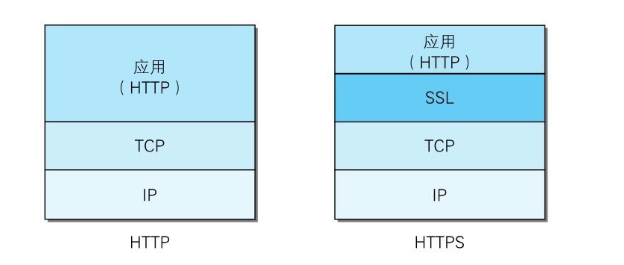

[toc]

#### HTTP 缺点

- 通信使用明文（不加密），内容可能会被窃听
- 不验证通信方的身份，有可能遭遇伪装
- 无法证明报文的完整性，有可能已遭篡改

所谓互联网，是由能连通到全世界的网络组成的。无论世界哪个角落的服务器在和客户端通信时，在此通信线路上的某些网络设备、光缆、计算机等都不可能是个人的私有物，所以不排除某个环节中会遭到恶意窥视行为。

即使已经过加密处理的通信，也会被窥视到通信内容，这点和未加密的通信是相同的。只是说如果通信经过加密，就有可能让人无法破解报文信息的含义，但加密处理后的报文信息本身还是会被看到的。

#### 通信加密

HTTP协议中没有加密机制，但可以通过和 **SSL**（Secure Socket Layer，安全套接层）或 **TLS**（Transport Layer Security，安全传输层协议）的组合使用，加密HTTP的通信内容。

用SSL建立安全通信线路之后，就可以在这条线路上进行HTTP通信了。与SSL组合使用的HTTP被称为**HTTPS**（HTTP Secure，超文本传输安全协议）或`HTTP over SSL`。

#### 内容加密

把HTTP报文里所含的内容进行加密处理。

为了做到有效的内容加密，前提是要求客户端和服务器同时具备加密和解密机制。由于该方式不同于SSL或TLS将整个通信线路加密处理，所以内容仍有被篡改的风险。

#### 安全隐患

HTTP协议的实现本身非常简单，不论是谁发送过来的请求都会返回响应，因此不确认通信方，会存在以下各种隐患：

-  无法确定请求发送至目标的Web服务器是否是按真实意图返回响应的那台服务器。有可能是已伪装的Web服务器。
- 无法确定响应返回到的客户端是否是按真实意图接收响应的那个客户端。有可能是已伪装的客户端。
- 无法确定正在通信的对方是否具备访问权限。因为某些Web服务器上保存着重要的信息，只想发给特定用户通信的权限。
- 无法判定请求是来自何方、出自谁手。
- 即使是无意义的请求也会照单全收。无法阻止海量请求下的DoS攻击（Denial of Service，拒绝服务攻击）。

虽然使用HTTP协议无法确定通信方，但如果使用SSL则可以。SSL不仅提供加密处理，而且还使用了一种被称为**证书**的手段，可用于确定通信方。

**证书由值得信任的第三方机构颁发**，用以证明服务器和客户端是实际存在的。另外，伪造证书从技术角度来说是异常困难的一件事。所以只要能够确认通信方（服务器或客户端）持有的证书，即可判断通信方的真实意图。

#### HTTPS

HTTPS并非是应用层的一种新协议。只是**HTTP通信接口部分用SSL（SecureSocket Layer）和TLS（Transport Layer Security）协议代替**而已。

通常，HTTP直接和TCP通信。当使用SSL时，则演变成先和SSL通信，再由SSL和TCP通信了。

在采用SSL后，HTTP就拥有了HTTPS的加密、证书和完整性保护这些功能。

**SSL是独立于HTTP的协议**，所以不仅是HTTP协议，其他运行在应用层的SMTP和Telnet等协议均可配合SSL协议使用。可以说SSL是当今世界上应用最为广泛的网络安全技术。

#### 加密技术

**对称密钥加密**：加密和解密同用一个密钥的方式，或称为**共享密钥加密**（Common key cryptosystem）。

以共享密钥方式加密时必须将密钥也发给对方。转发密钥时，如果通信被监听，密钥被获取后任何人都能破解密码。所以需要安全地保管接收到的密钥。

**公开密钥**加密方式很好地解决了共享密钥加密的困难。

公开密钥加密使用一对非对称的密钥。一把叫做**私有密钥**（private key），另一把叫做**公开密钥**（public key）。私有密钥不能让其他任何人知道，而公开密钥则可以随意发布，任何人都可以获得。

使用公开密钥加密方式，发送密文的一方**使用对方的公开密钥进行加密处理**，对方收到被加密的信息后，再**使用自己的私有密钥进行解密**。利用这种方式，不需要发送用来解密的私有密钥，也不必担心密钥被攻击者窃听而盗走。

另外，要想根据密文和公开密钥，恢复到信息原文是异常困难的，因为解密过程就是在对离散对数进行求值，这并非轻而易举就能办到。如果能对一个非常大的整数做到快速地因式分解，那么密码破解还是存在希望的。但就目前的技术来看是不太现实的。

HTTPS采用共享密钥加密和公开密钥加密两者并用的混合加密机制。

若密钥能够实现安全交换，那么有可能会考虑仅使用公开密钥加密来通信。但是**公开密钥加密与共享密钥加密相比，其处理速度要慢、效率低。**

#### SSL 速度慢

HTTPS也存在一些问题，那就是当使用SSL时，它的处理速度会变慢。

SSL的慢分两种。一种是指通信慢。另一种是指由于大量消耗CPU及内存等资源，导致处理速度变慢。

和使用HTTP相比，网络负载可能会变慢2到100倍。除去和TCP连接、发送HTTP请求、响应以外，还必须进行SSL通信，因此整体上处理通信量不可避免会增加。

另一点是SSL必须进行加密处理。在服务器和客户端都需要进行加密和解密的运算处理。因此从结果上讲，比起HTTP会更多地消耗服务器和客户端的硬件资源，导致负载增强。

为什么不一直使用HTTPS：

- 与纯文本通信相比，加密通信会消耗更多的CPU及内存资源。如果每次通信都加密，会消耗相当多的资源，平摊到一台计算机上时，能够处理的请求数量必定也会随之减少。
- 如果是非敏感信息则使用HTTP通信，只有在包含个人信息等敏感数据时，才利用HTTPS加密通信。

特别是每当那些访问量较多的Web网站在进行加密处理时，它们所承担着的负载不容小觑。在进行加密处理时，并非对所有内容都进行加密处理，而是仅在那些需要信息隐藏时才会加密，以节约资源。

最后，要进行HTTPS通信，证书是必不可少的。而使用的证书必须向认证机构（CA）购买。