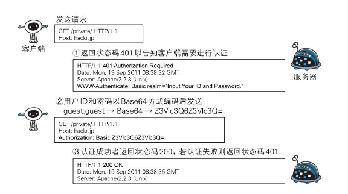
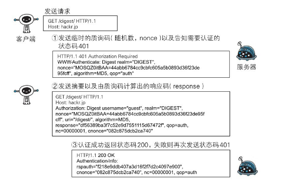

[toc]

## 认证方式

HTTP/1.1使用的认证方式：

- BASIC认证（基本认证）
- DIGEST认证（摘要认证）
- SSL客户端认证
- FormBase认证（基于表单认证）

## Basic 认证

Web服务器与通信客户端之间进行的认证方式。

BASIC认证的认证步骤：

1. 请求的资源需要BASIC认证时，服务器会随状态码`401 Authorization Required`，返回带`WWW-Authenticate`首部字段的响应。该字段内包含认证的方式（BASIC）及Request-URI安全域字符串（realm）。
2. 接收到状态码401的客户端为了通过BASIC认证，需要将**用户ID**及**密码**发送给服务器。发送的字符串内容是由用户ID和密码构成，两者中间以冒号（:）连接后，再经过Base64编码处理。
   - 假设用户ID为guest，密码是guest，连接起来就会形成`guest:guest`这样的字符串。然后经过Base64编码，最后的结果即是`Z3Vlc3Q6Z3Vlc3Q=`。把这串字符串写入首部字段`Authorization`后，发送请求。
   - 当用户代理为浏览器时，用户仅需输入用户ID和密码即可，浏览器会自动完成到Base64编码的转换工作。
3. 接收到包含首部字段Authorization请求的服务器，会对认证信息的正确性进行验证。如验证通过，则返回一条包含Request-URI资源的响应。

BASIC认证虽然采用Base64编码方式，但这不是加密处理。不需要任何附加信息即可对其解码。由于明文解码后就是用户ID和密码，在HTTP等非加密通信的线路上进行BASIC认证的过程中，如果被窃听，被盗的可能性极高。

---

## DIGEST 认证

DIGEST认证同样使用**质询/响应**的方式（challenge/response），但不会像BASIC认证那样直接发送明文密码。

所谓质询响应方式是指，一开始A会先发送认证要求给B，接着A使用从B那接收到的质询码计算生成响应码。最后A将响应码返回给B进行认证的方式。

DIGEST认证的认证步骤：

1. 请求需认证的资源时，服务器会随着状态码`401 AuthorizationRequired`，返回带`WWW-Authenticate`首部字段的响应。
   - 该字段内包含质问响应方式认证所需的临时质询码（随机数，nonce）。
   - 首部字段WWW-Authenticate内必须包含realm和nonce这两个字段的信息。客户端就是依靠向服务器回送这两个值进行认证的。
   - nonce是一种每次随返回的401响应生成的任意随机字符串。该字符串通常推荐由Base64编码的十六进制数的组成形式，但实际内容依赖服务器的具体实现。
2. 接收到401状态码的客户端，返回给服务器的响应中包含DIGEST认证必须的首部字段Authorization信息。
   - 首部字段Authorization内必须包含username、realm、nonce、uri和response的字段信息。其中，realm和nonce就是之前从服务器接收到的响应中的字段。
   - username是realm限定范围内可进行认证的用户名。
   - uri（digest-uri）即Request-URI的值，但考虑到经代理转发后Request-URI的值可能被修改，因此事先会复制一份副本保存在uri内。
   - response也可叫做Request-Digest，存放经过MD5运算后的密码字符串，形成响应码。
3. 服务端接收到包含首部字段Authorization请求，确认认证信息的正确性。认证通过后则返回包含Request-URI资源的响应。
   - 这时会在首部字段Authentication-Info写入一些认证成功的相关信息，同时可以看到响应中没有带`WWW-Authenticate`首部字段。
   - DIGEST认证提供了高于BASIC认证的安全等级，但是和HTTPS的客户端认证相比仍旧很弱。DIGEST认证提供防止密码被窃听的保护机制，但并不存在防止用户伪装的保护机制。

---

## SSL客户端认证

SSL客户端认证的认证步骤：

1. 接收到需要认证资源的请求，服务器会发送Certificate Request报文，要求客户端提供客户端证书。
2. 用户选择将发送的客户端证书后，客户端会把客户端证书信息以Client Certificate报文方式发送给服务器。
3. 服务器验证客户端证书验证通过后方可领取证书内客户端的公开密钥，然后开始HTTPS加密通信。

在多数情况下，SSL客户端认证不会仅依靠证书完成认证，一般会和基于表单认证（稍后讲解）组合形成一种双因素认证（Two-factor authentication）来使用。

所谓双因素认证就是指，认证过程中不仅需要密码这一个因素，还需要申请认证者提供其他持有信息，从而作为另一个因素，与其组合使用的认证方式。换言之，第一个认证因素的SSL客户端证书用来认证客户端计算机，另一个认证因素的密码则用来确定这是用户本人的行为。

**基于表单的认证**方法并不是在HTTP协议中定义的。客户端会向服务器上的Web应用程序发送登录信息（Credential），按登录信息的验证结果认证。

---

## Session & Cookie

鉴于HTTP是**无状态**协议，之前已认证成功的用户状态**无法通过协议层面保存**下来。即，无法实现状态管理，因此即使当该用户下一次继续访问，也无法区分他与其他的用户。于是我们会使用Cookie来管理Session，以弥补HTTP协议中不存在的状态管理功能。

过程：

1. 客户端把用户ID和密码等登录信息放入报文的实体部分，通常以POST方法把请求发送给服务器。而这时，会使用HTTPS通信来进行HTML表单画面的显示和用户输入数据的发送。
2. 服务器生成一个用以识别用户的Session ID。通过验证从客户端发送过来的登录信息进行身份认证，然后把用户的认证状态与Session ID绑定后记录在服务器端。
   - 向客户端返回响应时，会在首部字段`Set-Cookie`内写入Session ID（如PHPSESSID=028a8c…）。
   - 可以把Session ID想象成一种用以区分不同用户的等位号。然而，如果Session ID被第三方盗走，对方就可以伪装成你的身份进行恶意操作了。因此必须防止Session ID被盗或被猜出。为此，Session ID应使用难以推测的字符串，且服务器端也需要进行有效期的管理，保证其安全性。
   - 为减轻跨站脚本攻击（XSS）造成的损失，建议事先在Cookie内加上`httponly`属性。

3. 客户端接收到从服务器端发来的Session ID后，会将其作为Cookie保存在本地。下次向服务器发送请求时，浏览器会自动发送Cookie，所以Session ID也随之发送到服务器。服务器端可通过验证接收到的Session ID识别用户和其认证状态。

另外，不仅基于表单认证的登录信息及认证过程都无标准化的方法，服务器端应如何保存用户提交的密码等登录信息等也没有标准化。

通常，一种安全的保存方法是，先利用**给密码加盐**（salt）的方式增加额外信息，再使用散列（hash）函数计算出散列值后保存。但是我们也经常看到直接保存明文密码的做法，而这样的做法具有导致密码泄露的风险。

