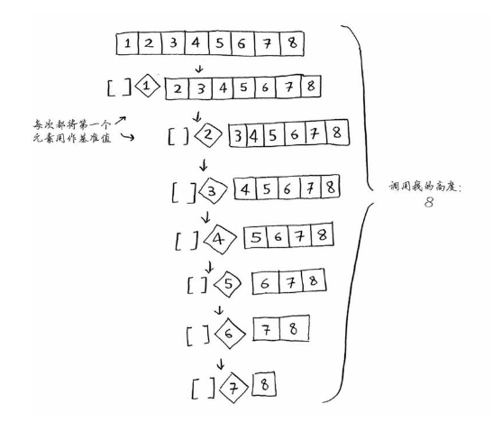
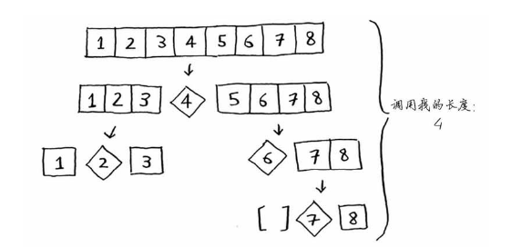

[toc]

## 二分法

二分查找是一种算法，其输入是一个有序的元素列表。如果要查找的元素包含在列表中，二分查找返回其位置；否则返回null。

仅当列表是有序的时候，二分查找才管用。例如，电话簿中的名字是按字母顺序排列的，因此可以使用二分查找来查找名字。

```python
import random

def binary_search(listarr, target):
    low = 0
    high = len(listarr) - 1
    count = 1
    while low <= high:
        mid = (low + high) >> 1
        guess = listarr[mid]
        if guess == target:
            print(f'by search {count} times, index of target num {target} is {mid}')
            return mid
        if guess < target:
            low = mid + 1
        else:
            high = mid - 1
        count += 1
    return None

if __name__ == '__main__':
    # 随机生成一个有序的列表，
    test_list = sorted([random.randint(1, 100) for i in range(10)])
    print(test_list)
    # 在有序随机列表中，随机挑选一个数字，用二分法找到其下标
    binary_search(test_list, random.choice(test_list))
```


每次介绍算法时，都将讨论其运行时间。一般而言，应选择效率最高的算法，以最大限度地减少运行时间或占用空间。

对于二分查找，使用它可节省多少时间呢？

简单查找逐个地检查数字，如果列表包含100个数字，最多需要猜100次。如果列表包含40亿个数字，最多需要猜40亿次。最多需要猜测的次数与列表长度相同，这被称为**线性时间**（linear time）。

二分查找则不同，如果列表包含100个元素，最多要猜7次；如果列表包含40亿个数字，最多需猜32次。二分查找的运行时间为**对数时间**（或log时间）。

---

## 大O表示法

大O表示法是一种特殊的表示法，指出了算法的速度有多快。

通常，仅知道算法需要多长时间才能运行完毕还不够，还需知道运行时间如何随列表增长而增加。

### 算法有多快

例如，假设列表包含n个元素：简单查找需要检查每个元素，因此需要执行n次操作。使用大O表示法，这个运行时间为O(n)。没有单位——大O表示法指的并非以秒(或者其他时间单位)为单位的速度。大O表示法让你能够比较操作数，它指出了算法运行时间的**增速**。

### 最糟情况下的运行时间

简单查找的运行时间为O(n)，这意味着在最糟情况下，必须查看电话簿中的每个条目。如果要查找的是Adit——电话簿中的第一个人，一次就能找到，无需查看每个条目。考虑到一次就找到了Adit，请问这种算法的运行时间是O(n)还是O(1)呢？

简单查找的运行时间总是为O(n)。查找Adit时，一次就找到了，这是最佳的情形，但大O表示法说的是最糟的情形。因此，可以说在最糟情况下，必须查看电话簿中的每个条目，对应的运行时间为O(n)。这是一个保证——知道**简单查找的运行时间不可能超过O(n)**。

### 常见的大O运行时间

从快到慢的顺序列出经常会遇到的5种大O运行时间：

- `O(log n)`，也叫对数时间，这样的算法包括**二分查找**。
- `O(n)`，也叫线性时间，这样的算法包括**简单查找**。
- `O(n * log n)`，这样的算法包括**快速排序**——一种速度较快的排序算法。
- `O(n2)`，这样的算法包括**选择排序**——一种速度较慢的排序算法。
- `O(n!)`，这样的算法包括**旅行商问题的解决方案**——一种非常慢的算法。

小结：

1. 算法的速度指的并非时间，而是操作数的增速。
2. 谈论算法的速度时，我们说的是随着输入的增加，其运行时间将以什么样的速度增加。
3. 算法的运行时间用大O表示法表示。
4. `O(log n)`比`O(n)`快，当需要搜索的元素越多时，前者比后者快得越多。

---

## 选择排序

### 数组和链表

将数据存储到内存时，需要请求计算机提供存储空间，计算机给一个存储地址。需要存储多项数据时，有两种基本方式——**数组和链表**。

读取元素：

- 如果需要随机地读取元素时，数组的效率很高，可迅速找到数组的任何元素；

- 如果需要同时读取所有元素时，链表的效率很高：读取第一个元素，根据其中的地址再读取第二个元素，以此类推。但如果需要跳跃，链表的效率真的很低；
- 在链表中，元素并非靠在一起的，你无法迅速计算出第五个元素的内存地址，而必须先访问第一个元素以获取第二个元素的地址，再访问第二个元素以获取第三个元素的地址，以此类推，直到访问第五个元素。

删除元素：

- 链表也是更好的选择，因为只需修改前一个元素指向的地址即可。
- 而使用数组时，删除元素后，必须将后面的元素都向前移。
- 不同于插入，删除元素总能成功。如果内存中没有足够的空间，插入操作可能失败，但在任何情况下都能够将元素删除。

常见的数组和链表操作的运行时间：

|      | 数组 | 链表 |
| ---- | ---- | ---- |
| 读取 | O(1) | O(n) |
| 插入 | O(n) | O(1) |
| 删除 | O(n) | O(1) |

需要指出的是，仅当能够立即访问要删除的元素时，删除操作的运行时间才为O(1)。通常我们都记录了链表的第一个元素和最后一个元素，因此删除这些元素时运行时间为O(1)。

数组和链表哪个用得更多？显然要看情况。

但数组用得很多，因为它支持随机访问。有两种访问方式：**随机访问**和**顺序访问**。顺序访问意味着从第一个元素开始逐个地读取元素。**链表只能顺序访问**：要读取链表的第十个元素，得先读取前九个元素，并沿链接找到第十个元素。随机访问意味着可直接跳到第十个元素。经常说数组的读取速度更快，这是因为它们支持随机访问。很多情况都要求能够随机访问，因此数组用得很多。

### 选择排序代码实现

```python
import random

def find_smallest(arr):
    smallest = arr[0]
    smallest_index = 0
    for i in range(1, len(arr)):
        if arr[i] < smallest:
            smallest = arr[i]
            smallest_index = i
    return smallest_index

def select_sort(arr):
    res = []
    for i in range(len(arr)):
        smallest_index = find_smallest(arr)
        res.append(arr.pop(smallest_index))
    return res

if __name__ == '__main__':
    arr = [random.randint(1, 100) for i in range(10)]
    print(select_sort(arr))
```

---

## 递归

有的情况，递归也可以写成循环的形式。

**如果使用循环，程序的性能可能更高；如果使用递归，程序可能更容易理解。如何选择要看什么对你来说更重要。**

每个递归函数都有两部分：

- 基准条件：指的是函数不再调用自己（出口），从而避免形成无限循环
- 递归条件：递归条件指的是函数调用自己

小结：

- 递归指的是调用自己的函数
- 每个递归函数都有两个条件：基准条件和递归条件
- 栈有两种操作：压入和弹出
- 所有函数调用都进入调用栈
- 调用栈可能很长，这将占用大量的内存

---

## 快速排序

快速排序使用**分而治之**（divide and conquer, D&C）的策略，比选择排序快得多。

最简单的数组：不需要排序的数组，比如数组为空或只包含一个元素。这种情况，可以原样的形式返回"排好序的"数组。（通常这种情况，作为基准条件/函数出口）

当数组不是最简单的数组形式时：

1. 首先，从数组中选择一个元素，这个元素被称为**基准值**（pivot）

2. 接下来，找出比基准值小的元素以及比基准值大的元素。此时得到：

   - 一个由所有小于基准值的数字组成的子数组
   - 基准值
   - 一个由所有大于基准值的数组组成的子数组

   这里只是进行了分区，得到的两个子数组是无序的。但如果这两个数组是有序的，对整个数组进行排序将非常容易。

3. 分别对两个子数组快速排序

   对于基准值左边的子数组以及右边的子数组（子数组可能为空），只要对这两个子数组进行快速排序，再合并结果，就能得到一个有序数组。

```python
import random

def quick_sort(arr):
    if arr == [] or len(arr) == 1:
        return arr
    base = arr[0]
    smaller_arr = []
    larger_arr = []
    for i in arr[1::]:  # 取出作为base的元素，再分区
        if i < base:
            smaller_arr.append(i)
        else:
            larger_arr.append(i)
    return quick_sort(smaller_arr) + [base] + quick_sort(larger_arr)

if __name__ == '__main__':
    arr = [random.randint(1, 100) for i in range(10)]
    print(quick_sort(arr))
```

---

### 再谈大O表示法

```python
import time

def print_item(arr):
    for i in arr:
        print(i)

def print_item2(arr):
    for i in arr:
        time.sleep(1)
        print(i)
```

两个函数遍历列表中的每个元素并将其打印出来。迭代整个列表一次，因此运行时间都为O(n)。不同的是，函数2在打印每个元素前都休眠1秒钟。

比较哪个更快呢？print_items要快得多，因为它没有在每次打印元素前都暂停1秒钟。因此，虽然使用大O表示法表示时，这两个函数的速度相同，但实际上print_items的速度更快。

在大O表示法O(n)中，n实际上指的是这样的：`n = c * n`，其中c是一个固定的时间量。通常不考虑这个常量，因为如果两种算法的大O运行时间不同，这种常量将无关紧要。

拿二分查找和简单查找来举例说明：

|            | 固定时间常量c | 运行时间     | 在40亿个元素的列表中查找所需时间 |
| ---------- | ------------- | ------------ | -------------------------------- |
| 简单查找   | 10 毫秒       | 10 毫秒 * n  | 10 毫秒 * 40 亿 = 463 天         |
| 二分法查找 | 1 秒          | 1 秒 * log n | 1 秒 * log 40 亿 = 32 秒         |

可以看出，二分查找的速度还是快得多，常量根本没有什么影响。因为两者不是一个数量级的，当 n 趋向于无穷大时，`log n / n`的极限为0，这种情况下，和 n 相比，log n 大小不算啥。

但有时候，常量的影响可能很大，对快速查找和合并查找来说就是如此。快速查找的常量比合并查找小，因此如果它们的运行时间都为O(n log n)，快速查找的速度将更快。实际上，快速查找的速度确实更快，因为相对于遇上最糟情况，它遇上平均情况的可能性要大得多。

---

### 平均情况和最糟情况

快速排序的性能高度依赖于选择的基准值。假设总是将第一个元素用作基准值，且要处理的数组是有序的。由于快速排序算法不检查输入数组是否有序，因此它依然尝试对其进行排序。

以有序数组为例，两种情况：每次都选择第一个作为基准值、选择中间的元素作为基准值。



算法的运行时间为`O(n) * O(n) = O(n2)`，这是最糟的情况，栈长为O(n)，在调用栈的每层都涉及O(n)个元素；




整个算法需要的时间为`O(n) * O(logn) = O(nlogn)`，这是最佳的情况，栈长为O(logn)，每次也将涉及O(n)个元素。

最佳情况也是平均情况。只要每次都随机地选择一个数组元素作为基准值，快速排序的平均运行时间就将为O(n log n)。快速排序是最快的排序算法之一，也是D&C典范。

小结：

- D&C将问题逐步分解。使用D&C处理列表时，基线条件很可能是空数组或只包含一个元素的数组。
- 实现快速排序时，请**随机**地选择用作基准值的元素。快速排序的平均运行时间为**O(nlogn)**。
- 大O表示法中的常量有时候事关重大，这就是快速排序比合并排序快的原因所在。
- 比较简单查找和二分查找时，常量几乎无关紧要，因为列表很长时，O(logn)的速度比O(n)快得多。

---

## 散列表

散列函数：是这样的函数，即无论你给它什么数据，它都还你一个数字。

- 散列函数是将同样的输入映射到相同的索引
- 散列函数将不同的输入映射到不同的索引
- 散列函数知道数组有多大，只返回有效的索引

结合使用**散列函数**和**数组**创建了一种被称为**散列表**（hash table）的数据结构。

散列表是一种包含额外逻辑的数据结构。数组和链表都被直接映射到内存，但散列表更复杂，它使用散列函数来确定元素的存储位置：

- 数组根据下标，链表根据前后关系直接获取内存中数据；
- 散列表根据散列函数先计算散列值，间接获取内存中数据；

散列表可能是最有用的，也被称为**散列映射**、**映射**、**字典**和**关联数组**。散列表的速度很快！

### 应用

- 模拟映射关系

  - 创建一个电话簿，将姓名映射到电话号码。该电话簿需要提供如下功能：1. 添加联系人及其电话号码；2. 通过输入联系人来查找其电话号码。对应着的就是：创建映射、查找。
  - DNS解析，将网址映射到IP地址。

- 防止重复

  假设有一个投票站，每人只能投一票，但如何避免重复投票呢？有人来投票时，你询问他的全名，并将其与已投票者名单进行比对。

  如果将已投票者姓名存储在列表中，这个函数的速度终将变得非常慢，因为它必须使用简单查找搜索整个列表。但如果存储在了散列表中，能够迅速知道来投票的人是否投过票。使用散列表来检查是否重复，速度非常快。

- 缓存

  缓存是一种常用的加速方式，所有大型网站都使用缓存，而缓存的数据则存储在散列表中。

  比如，请求访问一个页面时，客户端会将页面数据保存下来，当再次访问时，会首先检查散列表中是否存储了该页面，如果存在则直接返回缓存，减轻服务器压力。

  ```python
  cache = {}
  def get_page(url):
  	if cache.get(url):
  		return cache[url]
  	else:
  		data = get_data_from_server(url)
  		cache[url] = data
  		return data
  ```

### 冲突

散列函数总是将不同的键映射到数组的不同位置。—— 这几乎是不可能的。

良好的散列函数让数组中的值呈均匀分布。

- 散列函数很重要。有差的散列函数将所有的键都映射到一个位置，而最理想的情况是，散列函数将键均匀地映射到散列表的不同位置。
- 如果散列表存储的链表很长，散列表的速度将急剧下降。然而，如果使用的散列函数很好，这些链表就不会很长。

### 性能

在平均情况下，散列表执行各种操作的时间都为O(1)。**O(1)被称为常量时间**，它并不意味着马上，而是说不管散列表多大，所需的时间都相同。

|      | 散列表（平均情况） | 散列表（最糟情况） | 数组 | 链表 |
| ---- | :----------------: | :----------------: | :--: | :--: |
| 查找 |        O(1)        |        O(n)        | O(1) | O(n) |
| 插入 |        O(1)        |        O(n)        | O(n) | O(1) |
| 删除 |        O(1)        |        O(n)        | O(n) | O(1) |

在平均情况下，散列表的查找（获取给定索引处的值）速度与数组一样快，而插入和删除速度与链表一样快，因此它兼具两者的优点。

但在最糟情况下，散列表的各种操作的速度都很慢。因此，在使用散列表时，避开最糟情况至关重要。为此，需要避免冲突。避免冲突，需要：

- 较低的填装因子
- 良好的散列函数

### 填装因子

填装因子 = 散列表包含的元素数 / 位置总数

举例：

- 在散列表中存储100种商品的价格，而该散列表包含100个位置。那么在最佳情况下，每个商品都将有自己的位置，这个散列表的填装因子为1。
- 如果这个散列表只有50个位置呢？填充因子将为2。不可能让每种商品都有自己的位置，因为没有足够的位置！填装因子大于1意味着商品数量超过了数组的位置数。一旦填装因子开始增大，就需要在散列表中添加位置，这被称为调整长度（resizing）。

**填装因子越低，发生冲突的可能性越小，散列表的性能越高**。一个不错的经验规则是：一旦填装因子大于0.7，就调整散列表的长度。