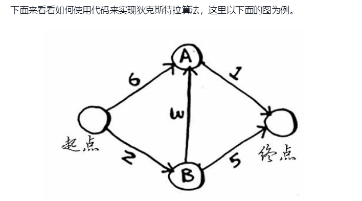

[toc]

## 广度优先搜索

第一种图算法——广度优先搜索（breadth-first search, BFS）。

广度优先搜索让你能够找出两样东西之间的最短距离，不过最短距离的含义有很多。最短路径指的并不一定是物理距离，也可能是让某种度量指标最小。

使用广度优先搜索可以：

-  编写国际跳棋AI，计算最少走多少步就可获胜；
- 编写拼写检查器，计算最少编辑多少个地方就可将错拼的单词改成正确的单词，如将READED改为READER需要编辑一个地方；
- 根据你的人际关系网络找到关系最近的医生；


**图**由节点（node）和边（edge）组成。一个节点可能与众多节点直接相连，这些节点被称为邻居；

**树**是一种特殊的图，其中没有往后指的边。

**队列**是一种先进先出（First In First Out, FIFO）的数据结构；

**栈**是一种后进先出（Last In First Out, LIFO）的数据结构。


---

## 狄克斯特拉算法

狄克斯特拉算法包含4个步骤：

1. 找出“最便宜”的节点，即可在最短时间内到达的节点；
2. 对于该节点的邻居，检查是否有前往它们的更短路径，如果有，就更新其开销；
3. 重复这个过程，直到对图中的每个节点都这样做了；
4. 计算最终路径。

狄克斯特拉算法用于每条边都有关联数字的图，这些数字称为权重（weight）。

带权重的图称为加权图（weighted graph），不带权重的图称为非加权图（unweighted graph）。

- 计算非加权图中的最短路径，可使用广度优先搜索
- 计算加权图中的最短路径，可使用狄克斯特拉算法

狄克斯特拉算法只适用于有向无环图（directedacyclic graph, DAG）。

实例：



```python
graph = {}
graph['start'] = {}
graph['start']['A'] = 6
graph['start']['B'] = 2
graph['A'] = {}
graph['A']['Final'] = 1
graph['B'] = {}
graph['B']['A'] = 3
graph['B']['Final'] = 5
graph['Final'] = {}

infinity = float('inf')
costs = {}
costs['A'] = 6
costs['B'] = 2
costs['Final'] = infinity

parents = {}
parents['A'] = 'start'
parents['B'] = 'start'
parents['Final'] = None

processed = []


def find_lowest_cost_node(costs):
    lowest_cost = float('inf')
    lowest_cost_node = None
    for node in costs:
        cost = costs[node]
        if cost < lowest_cost and node not in processed:
            lowest_cost = cost
            lowest_cost_node = node
    return lowest_cost_node


def get_lowest_cost(costs):
    cost = None
    node = find_lowest_cost_node(costs)
    while node is not None:
        cost = costs[node]
        neighbors = graph[node]
        for n in neighbors.keys():
            new_cost = cost + neighbors[n]
            if costs[n] > new_cost:
                costs[n] = new_cost
                neighbors[n] = node
        processed.append(node)
        node = find_lowest_cost_node(costs)
    return cost

if __name__ == '__main__':
    print(get_lowest_cost(costs))
```

---

## NP完全问题

没办法判断问题是不是NP完全问题，但还是有一些蛛丝马迹可循的：

- 元素较少时算法的运行速度非常快，但随着元素数量的增加，速度会变得非常慢。
- 涉及“所有组合”的问题通常是NP完全问题。
- 不能将问题分成小问题，必须考虑各种可能的情况。这可能是NP完全问题。
- 如果问题涉及序列（如旅行商问题中的城市序列）且难以解决，它可能就是NP完全问题。
- 如果问题涉及集合（如广播台集合）且难以解决，它可能就是NP完全问题。
- 如果问题可转换为集合覆盖问题或旅行商问题，那它肯定是NP完全问题。


- 贪婪算法寻找局部最优解，企图以这种方式获得全局最优解。
- 对于NP完全问题，还没有找到快速解决方案。
- 面临NP完全问题时，最佳的做法是使用近似算法。
- 贪婪算法易于实现、运行速度快，是不错的近似算法。

---

## 其他

动态规划、K最近邻算法

