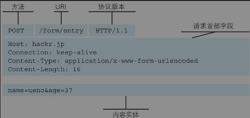
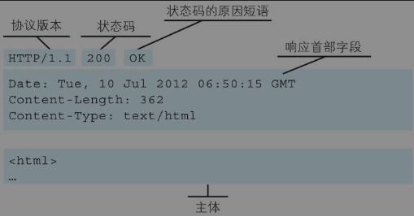
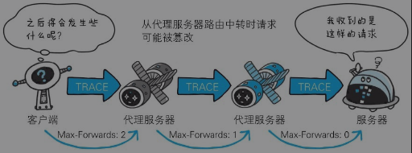
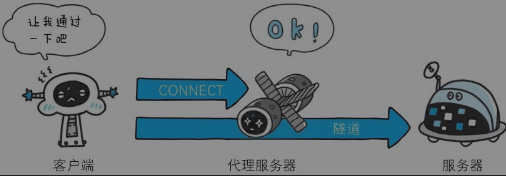
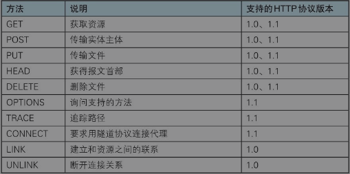
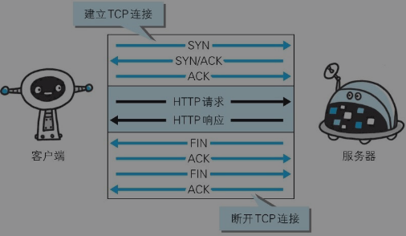
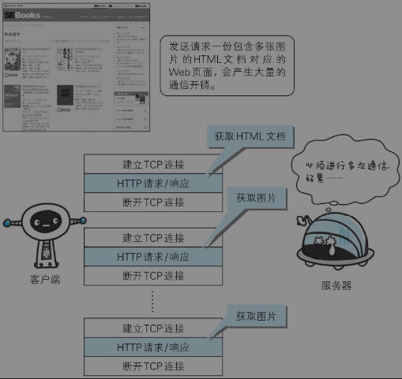
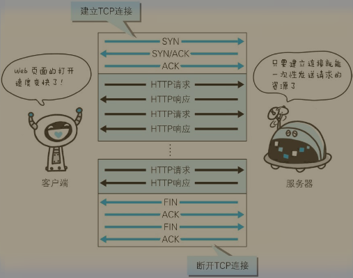
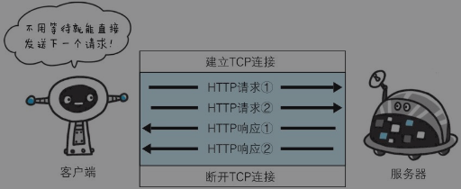

[toc]

## HTTP协议使用场景

### 客户端和服务器

HTTP协议和TCP/IP协议族内的其他众多的协议相同，用于客户端和服务器之间的通信。

请求访问文本或图像等资源的一端称为**客户端**，而提供资源响应的一端称为**服务器端**。

有时候，按实际情况，两台计算机作为客户端和服务器端的角色有可能会互换。但就仅从一条通信路线来说，服务器端和客户端的角色是确定的，而用HTTP协议能够明确区分哪端是客户端，哪端是服务器端。

HTTP协议规定，请求从客户端发出，最后服务器端响应该请求并返回。换句话说，肯定是先从客户端开始建立通信的，服务器端在没有接收到请求之前不会发送响应。

### 举例

请求访问某台HTTP服务器上的/index.htm页面资源:

```
GET /index.html HTTP/1.1
Host: hacker.jp
```

起始行开头的GET表示请求访问服务器的类型，称为方法（method）。随后的字符串/index.htm指明了请求访问的资源对象，也叫做请求URI（request-URI）。最后的HTTP/1.1，即HTTP的版本号，用来提示客户端使用的HTTP协议功能。

请求报文是由**请求方法**、**请求URI**、**协议版本**、可选的**请求首部字段**和**内容实体**构成的。例如：



收到请求后的响应:

```
HTTP/1.1 200 OK
Data:Tue, 10 Jul 2012 06:50:15 GMT
Content—Lenght:362
Content-Type:text/html
<html>
......
```

在起始行开头的HTTP/1.1表示服务器对应的HTTP版本。200 OK表示请求的处理结果的状态码（status code）和原因短语（reason-phrase）。下一行显示了创建响应的日期时间，是首部字段（header field）内的一个属性。接着以一空行分隔，之后的内容称为资源实体的主体（entity body）。

响应报文基本上由**协议版本**、**状态码**（表示请求成功或失败的数字代码）、**用以解释状态码的原因短语**、**可选的响应首部字段**以及**实体主体**构成。例如：



---

## HTTP无状态

HTTP是一种不保存状态，即**无状态**（stateless）协议。HTTP协议**自身不对请求和响应之间的通信状态进行保存**。也就是说在HTTP这个级别，协议对于发送过的请求或响应都不做持久化处理。

无状态，可以更快地处理大量事务，确保协议的可伸缩性。

但是有的需求需要网页保持状态，比如，网购场景，浏览商品跳转到下单的页面，需要保持用户登录状态。

HTTP/1.1虽然是无状态协议，但为了实现期望的保持状态功能，引入了Cookie技术。有了Cookie再用HTTP协议通信，就可以管理状态了。

---

## HTTP方法

### GET：获取资源

GET方法用来请求访问已被URI识别的资源。指定的资源经服务器端解析后返回响应内容。也就是说，如果请求的资源是文本，那就保持原样返回；如果是像CGI（Common GatewayInterface，通用网关接口）那样的程序，则返回经过执行后的输出结果。

### POST：传输实体主体

GET 和 POST 都可以用来**获取响应的主体的内容**、**传输实体的主体**。但是，一般使用 GET 进行获取响应的主体内容，使用 POST 传输实体的主体。

### PUT：传输文件

PUT 方法用来传输文件。就像 FTP 协议的文件上传一样，要求在请求报文的主体中包含文件内容，然后保存到请求URI指定的位置。

鉴于 **HTTP/1.1 的 PUT 方法自身不带验证机制**，任何人都可以上传文件，存在安全性问题，因此一般的Web网站不使用该方法。若配合Web应用程序的验证机制，或架构设计采用REST（Representational State Transfer，表征状态转移）标准的同类Web网站，就可能会开放使用PUT方法。

### HEAD：获得报文首部

HEAD 方法和 GET 方法一样，只是不返回报文主体部分。用于确认 URI 的有效性及资源更新的日期时间等。

### DELETE：删除文件

DELETE方法用来删除文件，是与PUT相反的方法。DELETE方法按请求URI删除指定的资源。

HTTP/1.1的DELETE方法本身和PUT方法一样不带验证机制，所以一般的Web网站也不使用DELETE方法。

### OPTIONS：询问支持的方法

OPTIONS方法用来查询针对请求URI指定的资源支持的方法。

使用OPTIONS方法的请求·响应的例子：

```
请求:
OPTIONS * HTTP/1.1
Host:www.hacker.jp

响应:
HTTP/1.1 200 OK
Allow:GET,POST,HEAD,OPTIONS
```

### TRACE：追踪路径

TRACE方法是让Web服务器端将之前的请求通信环回给客户端的方法。

发送请求时，在Max-Forwards首部字段中填入数值，每经过一个服务器端就将该数字减1，当数值刚好减到0时，就停止继续传输，最后接收到请求的服务器端则返回状态码200 OK的响应。

客户端通过TRACE方法可以查询发送出去的请求是怎样被加工修改/篡改的。这是因为，请求想要连接到源目标服务器可能会通过代理中转，TRACE方法就是用来确认连接过程中发生的一系列操作。但是，TRACE方法本来就不怎么常用，再加上它容易引发XST（Cross-SiteTracing，跨站追踪）攻击，通常就更不会用到了。



使用TRACE方法的请求·响应的例子:

```
请求：
TRACK /HTTP/1.1
Host:hacker.jp
Max-Forwords:2

响应：
HTTP/1.1 200 OK
Content-Type:message/http
Conetent-Length:1024

TRACK /HTTP/1.1
Host:hacker.jp
Max-Forwords:2 (返回响应包含请求内容)
```

### CONNECT：要求用隧道协议连接代理

CONNECT方法要求在与代理服务器通信时建立隧道，实现用隧道协议进行TCP通信。主要使用 **SSL**（Secure Sockets Layer，安全套接层）和 **TLS**（TransportLayer Security，传输层安全）协议把通信内容加密后经网络隧道传输。



使用CONNECT方法的请求·响应的例子：

```
请求：
CONNECT proxy.hacker.jp:8000 HTTP/1.1
Host:proxy.hacker.jp

响应
HTTP/1.1 200 OK (之后进入网络隧道)
```



---

## 持久连接

HTTP协议的初始版本中，每进行一次HTTP通信就要断开一次TCP连接。



使用浏览器浏览一个包含多张图片的HTML页面时，在发送请求访问HTML页面资源的同时，也会请求该HTML页面里包含的其他资源。因此，每次的请求都会造成无谓的TCP连接建立和断开，增加通信量的开销。



持久连接（HTTP Persistent Connections，也称为HTTP keep-alive或HTTP connectionreuse）的方法。特点：**只要任意一端没有明确提出断开连接，则保持TCP连接状态。**



持久连接的好处在于减少了TCP连接的重复建立和断开所造成的额外开销，减轻了服务器端的负载。另外，减少开销的那部分时间，使HTTP请求和响应能够更早地结束，这样Web页面的显示速度也就相应提高了。

在HTTP/1.1中，所有的连接默认都是持久连接，但在HTTP/1.0内并未标准化。虽然有一部分服务器通过非标准的手段实现了持久连接，但服务器端不一定能够支持持久连接。毫无疑问，除了服务器端，客户端也需要支持持久连接。

**管道化**

持久连接使得多数请求以管道化（pipelining）方式发送成为可能。从前发送请求后需等待并收到响应，才能发送下一个请求。管道化技术出现后，不用等待响应亦可直接发送下一个请求。



这样就能够做到同时并行发送多个请求，而不需要一个接一个地等待响应了。管道化技术则比持久连接还要快。请求数越多，时间差就越明显。

---

## Cookie的状态管理

HTTP是**无状态**协议，它不对之前发生过的请求和响应的状态进行管理，前后的请求时相互独立的，无法根据之前的状态进行本次的请求处理。

假设要求登录认证的Web页面本身无法进行状态的管理（不记录已登录的状态），那么每次跳转新页面就要再次登录，或者要在每次请求报文中附加参数来管理登录状态。

虽然无状态协议当然也有它的优点：**不必保存状态，可减少服务器的CPU及内存资源的消耗**。也正因为HTTP协议本身是非常简单的，所以才会被应用在各种场景里。

首次服务器端发送客户端的响应报文中，会含有一个叫做 Set-Cookie 的首部字段信息，然后客户端保存Cookie。下次客户端访问该服务器发送请求时，客户端会在请求报文中携带Cookie值。服务器端发现携带Cookie的客户端后，去检查客户端，然后对比服务器上的记录，最后得到之前的状态信息。

发生Cookie交互的情景，HTTP请求报文和响应报文的内容如下：

step1：请求报文，首部字段内没有Cookie的相关信息

```
GET /reader/ HTTP/1.1
Host: hacker.jp
```

step2：响应报文（服务器端生成Cookie信息）

```
HTTP/1.1 200 OK
Data: Thu, 12 Jul 2012 07:12:20 GMT
Server: Apache
<Set-Cookie:sid=2342333237879; paht=/; expires=Wed, 10-Oct-12 07:12:20 GMT>
Content-Type: text/plain; charset=UTF-8
```

step3: 请求报文（发送携带Cookie信息的报文）

```
GET /image/ HTTP/1.1
Host: hacker.jp
Cookie: sid=2342333237879
```

